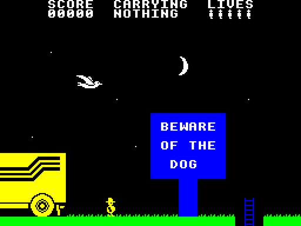
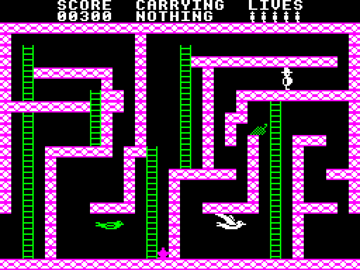
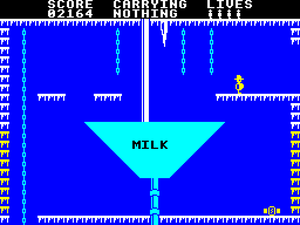
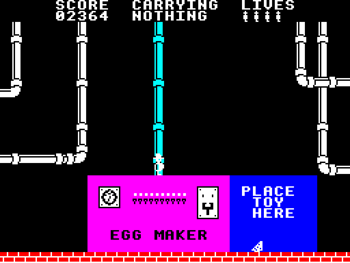
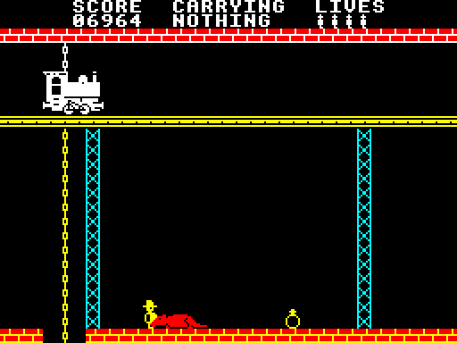
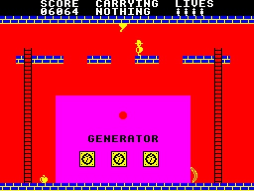
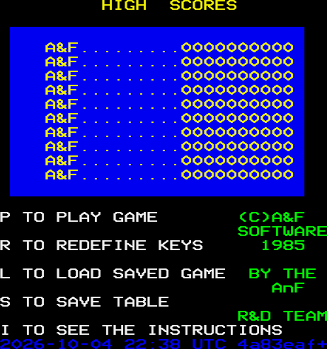
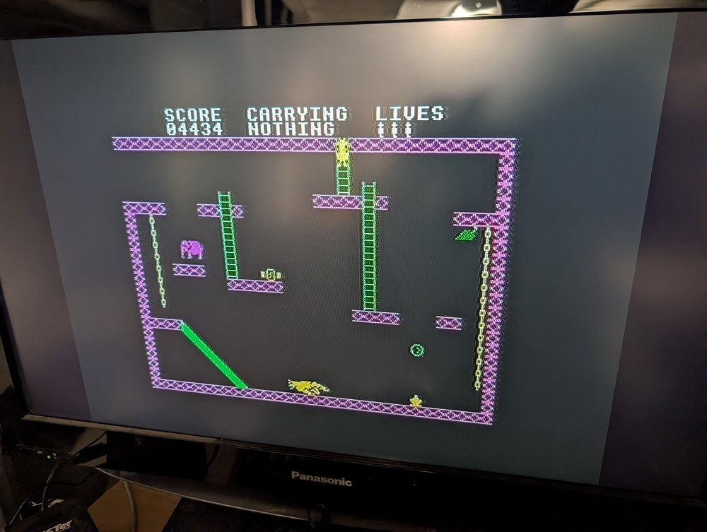

# Chuckie Egg 2 for the BBC Micro

A port of A&F Software's *Chuckie Egg 2* (1985) from the 48K ZX Spectrum to
the BBC Micro, in 6502 assembly: the original's own rooms, graphics, rules
and timing, carried across one routine at a time and checked against the
original as it runs.

### ▶ [**Play it in your browser**](https://bbc.xania.org/?disc=https://raw.githubusercontent.com/mattgodbolt/chuckie-egg-2-beeb/main/chuckie-egg-2.ssd&autoboot)

That link boots [`chuckie-egg-2.ssd`](chuckie-egg-2.ssd) in
[jsbeeb](https://github.com/mattgodbolt/jsbeeb).

| | |
|---|---|
|  |  |
|  |  |
|  |  |

## How to play

Henhouse Harry works in a chocolate egg factory of 120 rooms. To make an
egg he must find eight each of milk, cocoa and sugar around the factory
and drop them into the right vats, and the eight cyan parts of a toy kit
for the toy maker. Then the egg goes to dispatch, and the next egg starts,
with more monsters about. A few hints from the original: most factories
need power to work; Harry only has two hands for carrying things,
unless...; some pipes are more slippery than others.

| Key | In play |
|---|---|
| **Z** / **X** | left / right |
| **:** / **/** | up / down (the keys right of **;** and **.**; in jsbeeb on a PC keyboard, **'** and **/**) |
| **RETURN** | jump |
| **TAB** | take or drop |
| **S** | save the game (to disc) and carry on |
| **R** | abort, back to the menu |
| **BREAK** | back to the menu |

From the menu: **P** plays, **R** redefines the keys, **L** loads a saved
game, **S** saves (the high-score table, and the game if one was in
progress), **I** shows the instructions again. Saving and loading list the
disc and ask for a filename, offering the last one used.

The original's hidden developers' cheats are here too: **f0** on the menu
turns them on (SHIFT with left or right changes room, and lives never run
out), and **f1**-**f8** then choose the starting egg.



## What it runs on

A BBC Model B with 16K of sideways RAM, or a Master 128 (from DFS or
ADFS). The game's data fills a sideways RAM bank; the front end finds a
free one. On real hardware, write `chuckie-egg-2.ssd` to a disc (or put it
on a Gotek or an MMFS card) and SHIFT-BREAK.



*On Matt's own Master 128, loading and saving and all.*

A stock Model B without sideways RAM isn't supported;
[docs/stock-b.md](docs/stock-b.md) is an exploratory study of what it
would take (a disc edition loading each room as Harry enters it), tracked
for the future as [issue #1](https://github.com/mattgodbolt/chuckie-egg-2-beeb/issues/1).

## How close is it?

The original is the specification. Every room is drawn by a transcription
of the original's room drawer from the original's data, and compared pixel
for pixel with the Spectrum's own drawing of it (all 120 match). Harry's
movement, the monsters, the objects, the factory, the truck, the train and
the lifts are the original's code in 6502, and scripted play is compared
pass by pass with the original running in SkoolKit's Z80 simulator: 22
scenarios and random walks, identical. The game keeps the original's
three frames a pass everywhere.

What the BBC changes is written down, with the reasons, in
[docs/decisions.md](docs/decisions.md). The biggest: MODE 1's four colours
per band, with up to two palette changes down the screen in a room that
needs more (99.5% of pixels in the original's colour); the sound chip in
place of the beeper; a MODE 7 front end that saves to disc; and BBC keys.

[docs/how-it-works.md](docs/how-it-works.md) is a friendly, illustrated
tour of how the game and the port work: the factory, the map format,
Harry, the monsters, the puzzle (with a spoiler warning) and the BBC side.
[docs/journal.md](docs/journal.md) is the story of the port;
[docs/research.md](docs/research.md) is how the original works; and
[docs/next-steps.md](docs/next-steps.md) is what's left.

## Building

Needs [baron](https://github.com/waitingforvsync/baron) (looked for at
`../baron/build/src/baron`, else on the PATH), node, and for the Python tools
[uv](https://github.com/astral-sh/uv).

```sh
npm install     # the jsbeeb MCP client the test tools use
make venv       # SkoolKit and Pillow, for the tools that read the original
make fetch      # download the original from Spectrum Computing
make            # build/ce2.ssd
make run        # boot it headless and screenshot it
make check      # every room, the play scenarios, the front end and the
                # sound, against the original (MODEL=Master for the Master)
```

`make fetch` downloads the original's tape and checks its hash; the tools
in `tools/` extract the rooms, graphics and text from it into `src/data/`
(committed, so a build needs only baron).

## Licence

The port's own work, its source code, tools and documentation, is under the
[MIT licence](LICENSE). *Chuckie Egg 2* itself is © 1985 A&F Software: the
game's design, rooms, graphics, text and sounds, which `src/data/` and the
disc image carry, are theirs and not covered by that licence.

## Credits

*Chuckie Egg 2* is by A&F Software ("by the A&F R&D team", as its menu
says). This port is by Matt Godbolt and Claude, with suggestions from Rich
Talbot-Watkins.
