# How Chuckie Egg 2 works

A guided tour of A&F Software's *Chuckie Egg 2* (ZX Spectrum, 1985) and of
this BBC Micro port: how the factory is built, how a room is stored and
drawn, how Harry and the monsters move, how the egg-making puzzle hangs
together, and what the BBC had to do to fit it all in.

This is the friendly version. The reference material behind it is in
[research.md](research.md) and [research/](research/) (the original, from
its disassembly), [decisions.md](decisions.md) (every place the port
differs, numbered) and [journal.md](journal.md) (the story of the port).
Names in `code font` are the port's labels in `src/`, so you can go and
look.

Every screenshot here is the port running in jsbeeb, unless it says it's
the Spectrum's. Some scenes were set up for the picture, as the tests set
them up (seven milks already in the vat before the eighth is dropped, say).
The scripts that made the pictures are in `tools/guide/`.

## The factory

Henhouse Harry works in a chocolate egg factory of 120 rooms. They sit in a
grid ten rooms wide and twelve deep, numbered left to right and top to
bottom, so walking off the right of a room adds 1 to the room number, off
the left takes 1 away, and going down or up adds or takes away 10. Room 1,
top left, is outside under the night sky, where the delivery truck drops
Harry off.

[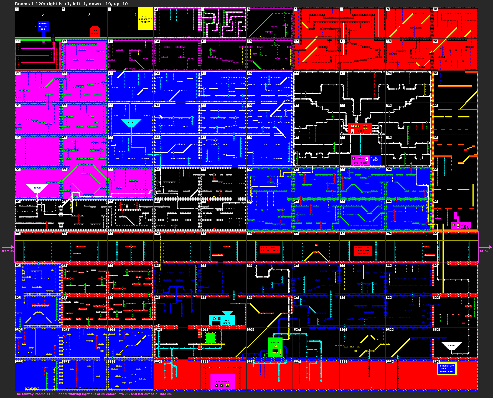](images/factory-map.png)

There is one exception to the grid. Rooms 71 to 80, the eighth row, are a
railway, and its ends are joined: walk right out of room 80 and you come
into room 71, walk left out of 71 and you're in 80 (`change_room`). A train
runs round that loop once the factory has power.

The joins between rooms are just the edges of the screen
(research/harry.md section 10). When Harry's position goes past an edge,
the game changes the room number, puts him at the opposite edge at the same
height (or the same column, going up and down) and draws the new room. The
whole screen is redrawn; nothing scrolls.

## What a room is made of

The Spectrum's screen is 32 character cells across and 24 down, each cell
8 x 8 pixels. The top two rows are the status bar (SCORE, CARRYING, LIVES);
the room fills the other 22. Every cell of the room has three things:

- a **tile**: 8 x 8 pixels from a font of 60 tiles (brick, grass, ladder
  rungs, pipe pieces, slopes, spikes; they're drawn in
  [research/img/tiles.png](research/img/tiles.png)), or a letter, for the
  signs;
- an **attribute**: the Spectrum's ink and paper colours for that cell;
- a **cell type**: one byte saying what the cell *is* to anything moving
  through it.

When a room is drawn, all three go into three 768-byte maps, one byte per
cell (`attr_map`, `tile_map` and `type_map`, at `&0400`, `&0700` and
`&0A00` on the BBC). Everything after that works from the maps. Harry's
movement reads the cell types. Erasing a sprite puts back the room's
pixels from the tile and attribute maps. The collision test uses the tile
map to tell the room's own pixels from a monster's.

The cell type is a set of bits:

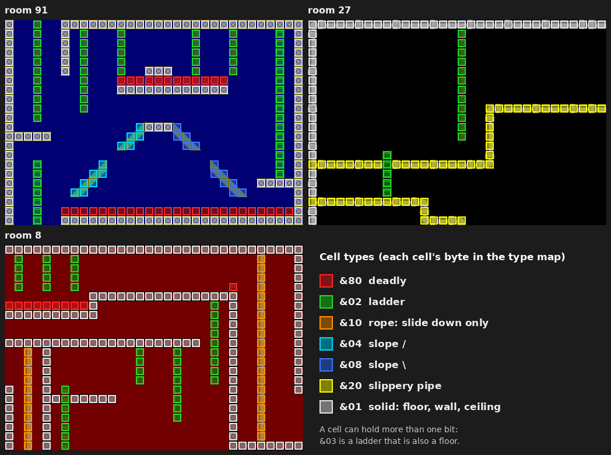

| Bit | Value | Meaning |
|---|---|---|
| 0 | `&01` | solid: a floor to stand on, a wall, a ceiling |
| 1 | `&02` | ladder (spiders' threads are ladder cells too) |
| 2, 3 | `&04`, `&08` | a slope rising to the right, or to the left |
| 4 | `&10` | rope: Harry can only slide down it |
| 5 | `&20` | slippery pipe: it holds Harry only while he walks |
| 7 | `&80` | deadly |

Bits combine. Where a ladder passes through a floor, that cell is `&03`,
ladder and floor at once: Harry can climb through it, and stop on it with
his feet on the floor to step off. The inside of a vat (a hopper, below)
is `&80`, deadly, so jumping into the milk is a bad idea.

Notice what isn't in a room: the monsters, the objects lying about, the
truck, the train and the lifts. Those are kept elsewhere and put into the
room after it's drawn, as later sections show.

## The map format

### The original's records

The original stores each room as a little program: a byte for the room's
background colour, then a list of records, each one drawing something,
until a 0 (research.md, "The room format"). The 120 rooms take 13,633
bytes, 114 on average. A record starts with a command byte:

| Command | Bytes | Draws | In the game |
|---|---|---|---|
| `&2C`-`&5F` | 6 | a run of one tile, across or down. The command byte *is* the tile | 1,587 |
| `&20`-`&2B` | 7 | a capped run: a pipe, with an end tile at each end | 232 |
| `&0A` | 6 | one tile | 193 |
| `&08`, `&09` | 6 | a diagonal, up or down to the right: a slope | 49 + 24 |
| `&02` | 4 + text + 1 | a line of text, ended by `&80` | 32 |
| `&01` | 7 | a solid block | 21 |
| `&03`-`&06` | 5 | a pipe bend, one of four fixed shapes | 21 |
| `&07` | 6 | a hopper: a funnel, two cells narrower each row | 5 |
| `&00` | 1 | the end of the room | 120 |

A run, the record that does most of the work, is
`tile attr row col len type`: start at (row, col), put `len` copies of the
tile there in the colours of `attr`, going down instead of across if bit 7
of `len` is set, and OR `type` into the type map under each one. Every
other record works the same way: whatever tiles it puts down, it records
in all three maps.

Here is room 51, the cocoa vat, drawn by the port one record at a time. It
has only nine records, 61 bytes, but uses most of the kinds.


Reading the bytes:

- `18`: the background. A Spectrum attribute keeps the ink in bits 0-2 and
  the paper in bits 3-5, so `&18` is paper 3, magenta. Every cell starts
  as that paper, with the ink the same.
- `40 21 02 00 20 01`: tile `&40` (the green and blue brick) in attribute
  `&21` (green paper, blue ink), row 2, column 0, 32 across, type `&01`:
  the ceiling.
- `40 21 17 00 20 01`: the same at row 23: the floor.
- `40 21 03 00 94 01`: `&94` has bit 7 set, so this goes down, 20 cells:
  the left wall.
- `40 21 0C 1F 8B 01`: down 11 from row 12 at column 31. The right wall
  stops at row 12, so the room's top right is open: the way into room 52.
- `40 21 0C 16 09 01`: a ledge, 9 across at row 12.
- `0A 1C 55 0B 1F 04`: one tile, `&55`, the top of a `/` slope, at row 11,
  column 31, with type `&04`. It makes the corner of the ledge a little
  ramp.
- `07 1F 0E 08 06 0F`: the hopper: six rows, the first 15 cells wide, each
  row two narrower than the one above.
- `02 38 10 0D 43 4F 43 4F 41 80`: "COCOA", in black on white, at row 16.
- `20 1F 14 0F 84 00 00`: a capped run going down four cells from under
  the hopper: its outlet pipe.

The port draws rooms with a line-by-line transcription of the original's
drawer (`draw_room` and the `cmd_` handlers in `src/rooms.6502`), quirks
and all, because the maps it builds must match the original's byte for
byte. Two quirks give the flavour:

- A run's handler pushes the command byte and the last two data bytes on
  the stack and pops them back crosswise, so the *command* is the tile and
  the last byte is the type. (Getting that the wrong way round was an early
  bug in the port, found because the tile and type maps disagreed in
  exactly mirrored cells.)
- The hopper handler sets the cell type of each row's left edge to the low
  byte of the Spectrum's attribute address for that row. It's an accident
  of the code, harmless in play, and the port copies it because the type
  map has to match.

### How the port packs them

The BBC is short of memory (more on that later), so the port stores the
rooms more tightly: 6,845 bytes instead of 13,633, with 124 bytes of tables
to unpack them (decisions 5 and 21). General-purpose compression did
poorly here: a room is mostly short records whose fields repeat, and an LZ
packer per room only got the rooms down to 10,220 bytes. So
`tools/packrooms.py` writes each room as a stream of bits shaped to the
data:

- **What kind of record**: a prefix code, commonest shortest. A run, the
  great majority, costs one bit, `0`.

  | Code | Record | Code | Record |
  |---|---|---|---|
  | `0` | run | `11100` | text |
  | `100` | capped run | `11101` | block |
  | `101` | single tile | `111100` | bend |
  | `1100` | diagonal up | `111101` | hopper |
  | `1101` | diagonal down | `11111` | end |

- **Attribute, tile and type**: each is coded against a list of the last
  three values that field had in this room. The same as last time costs
  one bit, `0`; the second or third in the list, `10` or `110`; anything
  else, `111` and then its number in a list of every value that field
  takes anywhere in the game (38 attributes, 49 tiles and 8 cell types, so
  6, 6 and 3 bits). Within a room the same few colours, tiles and types
  come back about 80% of the time.
- **Rows, run lengths and the ends of capped runs**: tier codes. A field's
  values are sorted commonest first and split into three tiers, coded `0`,
  `10` and `11`, each followed by a few bits to say which value in the
  tier. The widths are chosen to make the whole game's stream shortest.
  Columns stay a plain five bits: their values are spread too evenly for
  a code to help.

The fields come in the bytecode's own order, so the unpacker can emit each
byte as soon as it has decoded it. Room 51's second record shows the
effect: six bytes become 17 bits.

```
record    40 21 17 00 20 01                                 48 bits
packed    0    0     0      0010     00000   0       000        0     17 bits
          run  tile  attr   row 23   col 0   across  length 32  type
               (as before)  (third commonest row)  (the commonest length)
```

Room 51 as a whole goes from 61 bytes to 37. The room's first byte isn't
the original's attribute any more: it holds the paper colour (all the
drawer ever used of it) and the number of the room's BBC palette.

The port's drawer doesn't know any of this happened. It asks `fetch` for
the next byte, as the original's drawer reads the next byte of the room;
`fetch` hands out bytes from an 18-byte buffer, and when the buffer runs
dry `unpack_record` decodes the next record into it (`src/unpack.6502`).
So the transcribed drawer runs unchanged on the original's bytecode, one
record at a time, and the round trip is checked for every room whenever
the packer runs.

One record in the whole game says column 32 (in room 33). The original's
arithmetic carries that into column 0 of the next row, so the packer
stores it that way.

## Henhouse Harry

### Where he is

The original keeps Harry in a 26-byte record of Spectrum screen addresses.
All its logic actually needs is his top-left cell, the pixel line within
it (`yf`, 0-7) and his position across within it in 2-pixel steps (`xf`,
0-3). The port keeps exactly those (`h_cell`, `h_yf`, `h_xf`).

Harry is 16 pixels tall and moves across in 2-pixel steps, and nothing is
shifted when he's drawn. Instead there are four pictures of him facing
each way, each already drawn 0, 2, 4 or 6 pixels to the right, and those
four are also his walking poses. The walk cycle *is* the position: as
`xf` steps through 0-3 his legs move. Three more frames are for climbing.

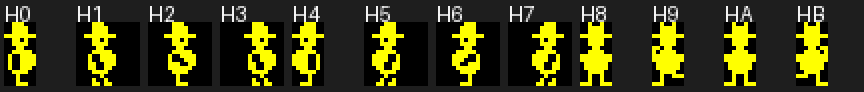

### His states

Harry is always in one of nine states (`h_state`, the original's `&A487`),
and each has its own routine (`harry_update` jumps to it):

| State | | What happens |
|---|---|---|
| 0 | falling | 4 pixels down a pass, keys ignored |
| 1 | walking | 2 pixels a pass; standing still is walking with no key |
| 2 | on a slippery pipe | walking, but stop and he drops through |
| 3 | on a ladder | 2 pixels up or down a pass |
| 4 | on a rope | slides down: 1, 2 or 3 pixels a pass by the keys |
| 5 | walking up a slope | 2 across and 2 up while the uphill key is held |
| 6 | sliding down a slope | 2 across and 2 down, keys ignored |
| 7 | jumping | along the jump table, direction fixed at take-off |
| 8 | riding a lift | moves with the lift |

A "pass" is one go round the main loop, three frames, so 16.7 a second
(the main loop has its own section below). Walking at 2 pixels a pass is
33 pixels a second.

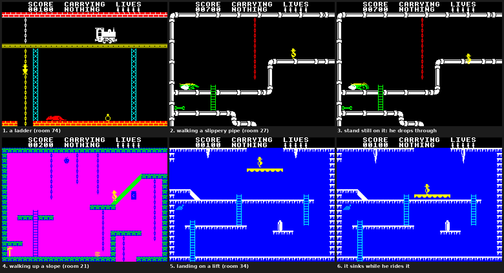

A few of the rules, all straight from the original (research/harry.md
sections 7 and 8):

- **Walls** are only checked when he is lined up with a cell (`xf` 0),
  against the head cell and the leg cell ahead.
- **Walking off an edge**: when he's half over the edge and there's no
  floor ahead, the next step is 4 pixels across and 4 down, then he
  falls.
- **Falling** counts passes. Landing with the count at 15 or more kills
  him: seven cells is a safe drop, eight is not.
- **Ladders**: he grabs one when lined up with it and holding up or down,
  even in mid-air. Room 1's short ladder sticks up two cells past the
  ground and can't be walked off at the top, only jumped off.
- **Ropes** can't be climbed. Holding up only slows the slide.
- **Slopes**: walk into one at leg height and he starts up it; let go of
  the key and he slides back down. Land on one from above and he snaps
  onto it.
- **Slippery pipes** are the instructions' "some pipes are more slippery
  than others": they hold him while he keeps walking.
- **Lifts**: land on one from above and he rides it; walk off either end
  and he falls; a solid cell at head height while riding crushes him.

### The jump

A jump is a table of 21 vertical steps, one per pass, read in order: up
4, 4, 3, 2, 1, 1, 1, then four level passes, then down. Sideways he moves
2 pixels a pass in the direction chosen at take-off, and the keys do
nothing until he lands.

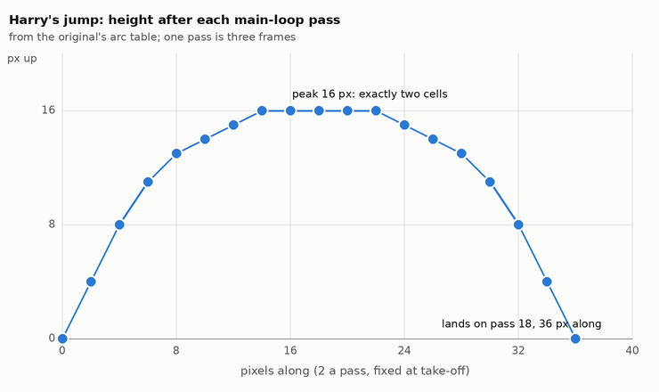

The peak is 16 pixels, exactly two cells, so a ledge two cells up is just
reachable, and only while he is level at the top. In the air a ceiling
ends the rise early, a wall bounces him back the other way, and a ladder
can be grabbed. Carrying a basket skips the table's first three steps, so
the jump is only 5 pixels high: hands full, heavy feet.

### Bumping into things

Scenery is tested by cell type, at the cells the movement code looks at.
Wherever it looks at a cell (a ceiling, a landing, a wall), a deadly bit
kills him.

Everything else is tested by pixels, twice a pass, as the original does:
is there anything on the screen inside Harry's 8-pixel-wide window that is
neither Harry's own pixels nor the room's (`collide`)? If so, character
cell boxes decide who it was, in order: the object currently being drawn
(see "Things", below), then the monsters in turn, then two rules for
particular rooms: the train in rooms 71-80 and the truck at dispatch. A
monster either kills, bounces Harry into a jump in a random direction, or
does nothing.

### Death, checkpoints and lives

When Harry enters a room walking or on a ladder, his whole state is copied
as a checkpoint. When he dies, the life-lost tune plays (about two
seconds, with everything frozen), he goes back to the checkpoint, whatever
he was carrying goes back to where he found it (the toy and the egg he
keeps), and a life is gone (`harry_died`).

Entering a room falling or jumping doesn't take a checkpoint, so a death
can send him back a room or more. That surprised Matt in his first game,
but it's the original's rule, and both machines agree on it pass for pass
(the `checkpoint-fall` scenario).

He starts with five lives, and gets one more for each of the six big steps
in making an egg. The status bar shows up to nine.

## The monsters

The monsters aren't in the rooms either. They are in one table of 256
entries, each a room, a starting row and column, and one of 52 types
(`monster_table`, the original's `&6B00`). When Harry enters a room, the
game looks through all 256 for the ones in that room. There are never
more than four in a room.

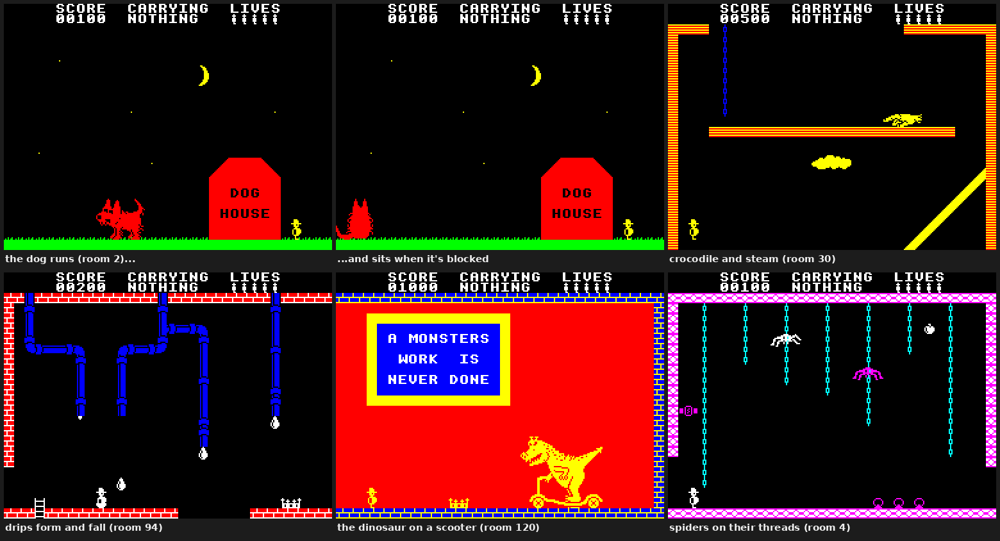

A type is four bytes: colour, first frame, flags and speed
([research/img/monster-types.png](research/img/monster-types.png) has
them all). The flags say how it behaves: whether it moves across or up
and down, needs a floor (or a thread, for spiders) or flies, kills or
bounces, starts going left, goes back to its start when blocked, or never
moves at all. Walkers turn round at walls, at the edges of the screen and
at the ends of platforms; flyers only at walls and edges.

Every monster gets two ticks a pass and moves on every *n*th, by its
speed. Each tick also calls the random number generator once per
monster, and the bubbles, drips, icicles and clouds use it to decide when
to form and when to drop. Since everything random in the game comes from
that one generator, the port has to call it the same number of times in
the same order as the original, or the drips fall at different moments.

Two rooms have a special event when a monster is blocked. In room 120 the
dinosaur on its scooter stops. In room 2 the dog sits down for good, and
the bone is deleted wherever it is. (The original also marks the bone's
cells as an obstacle in room 2's map at the bone's row and column, even
when the bone is somewhere else entirely; it's harmless and kept.)

## The truck, the train and the lifts

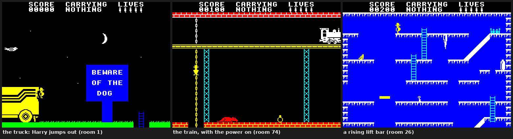

- **The truck** stands in rooms 1 and 111. At the start of every egg it
  drives into room 1 and Harry jumps out; when an egg is delivered it
  drives away. It is painted in seven strips, and in its rooms one strip
  is repainted every pass, which mends the holes the sprites erase in it.
- **The train** runs round rooms 71-80, half a column a pass, but only
  while the factory has power. It starts each egg in room 74. Touching
  it is fatal, and so the original's test is blunt: in rooms 71-80, any
  foreign pixel in Harry's window while his top is in rows 0-7 kills him.
  The signs say DO NOT WALK ON THE TRACK.
- **The lifts** are in rooms 26 and 55 (a short bar that rises from the
  bottom of the room to the top, over and over) and 34 and 104 (a platform
  that sinks while Harry rides it and comes back up when he gets off).
  Without power, none of them moves.

## Things

Everything else in the factory that isn't scenery or a monster is one of
256 **things** (`things`, the original's `&6600`): four arrays of 256
bytes holding each thing's room, row, column and type. A thing that isn't
in the world (carried, used up, or not made yet) has bit 7 of its room set,
which matches no room.

- Things 0-`&28` are the 41 that move about: 8 toy parts, 8 each of
  milk, cocoa and sugar, 4 baskets, a bone, a girder, a ladder, the toy
  and the egg. All but the girder can be carried.
- `&29`-`&39` are 17 parts of machines that appear and disappear: lights,
  FULL! signs, the generator's lamp and lever, the LIFT sign.
- `&3A`-`&FF` are 198 bonus items: fruit, sweets, crowns, rings, tools,
  keys. Touch one and it's gone for the rest of the egg, for its value in
  hundreds of points times the egg number, plus a random handful of tens
  and units. (The keys in the instructions are only bonus items: there
  are no doors.)


Things are drawn in an unusual way. Each time the main loop calls
`next_object` (twice a pass) it moves on to the next thing in the current
room, and that one thing is drawn every frame until the next call. Only
that "current thing" can be touched. So the things in a room pop into
view one by one over the first few frames, and one erased by a passing
monster comes back on its next turn.

On entering a room, each portable thing in it marks its cells in the type
map, which makes things obstacles to monsters, a dropped ladder
climbable and the girder something to stand on.

**Taking and dropping** share one key. Harry can carry one thing. Pressing
the key while touching the current thing takes it; pressing it again while
standing drops what he carries where he stands, its bottom level with his
feet (unless something is already there). A dropped thing doesn't fall:
drop it off a ledge and it hangs in the air. The one exception is a vat,
below.

**Scoring** is ten digits. Points come from the first visit to each room
in an egg (0 to 1,000 per room, times the egg number), from bonus items,
and from the six big steps of making an egg.

## The egg factory

The aim, as the instructions put it: find eight each of milk, cocoa and
sugar and get them into their vats, find the eight parts of a toy kit for
the toy maker, and send the finished egg out from dispatch. The
instructions also drop three hints: most factories need power to work;
Harry has only two hands, unless...; and some pipes are more slippery than
others.

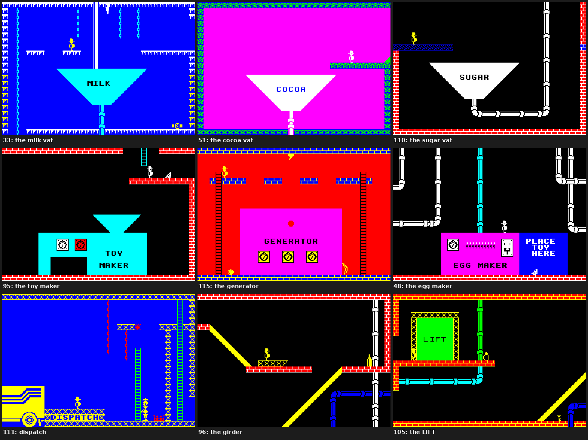

The puzzle is solved by those rooms and the things in them. If you'd like
to work it out yourself, skip the next section.

## Spoilers: the whole puzzle

> **Spoiler warning.** This section gives away where everything is and
> how every machine works. Skip to "Egg after egg" to avoid it.

The factory's state is one byte of flags (`factory`, the original's
`&A48C`): power, toy made, girder in place, toy on the egg maker, egg
made, and the three vats full. Every step below sets one of them.

### The ingredients and the vats

| | Where they start | Vat |
|---|---|---|
| milk | rooms 24, 26, 34, 35, 36 (two), 45, 46 | room 33 |
| cocoa | rooms 12, 21, 22, 31, 32, 41, 42, 53 | room 51 |
| sugar | rooms 86, 87, 88, 89, 97, 98, 99, 100 | room 110 |
| toy parts | rooms 82, 83 (three), 92 (two), 93 (two) | the toy maker, room 95 |

To put something in a vat, stand at a ledge above the hopper and drop it
so that it hangs out over the drop: gravity exists only here. In those
four rooms, a thing of the right kind dropped with nothing under its left
column, anywhere from column 9 to 23, falls, 2 pixels at a time, and is
counted when it lands. The eighth of an ingredient lights FULL!, scores
10,000 times the egg number and gives a life.

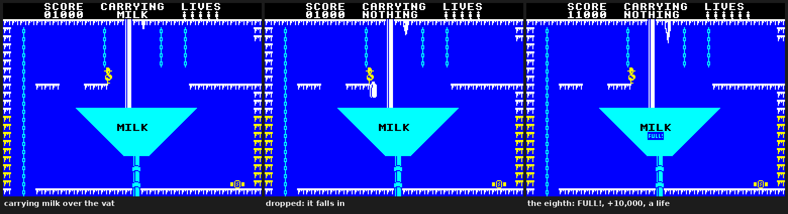

"Two hands, unless..." means **baskets**. There are four, one for each
kind: toy parts (room 94), milk (24), cocoa (42) and sugar (108). Carrying
a basket, touching a thing of its kind and pressing TAKE puts it in the
basket, with no limit. Drop the basket into the right vat and its whole
load counts. The price: the basket weighs Harry down, so his jumps are
only 5 pixels high and he can't grab ladders in mid-air.

Two quirks of the original, kept: the vat counts "exactly 8 after adding",
so an empty basket dropped into a vat that is already full awards the
10,000 and the life again (once per basket); and with a basket in hand,
the TAKE that should collect an item can drop the basket instead, if
there's room beside Harry.

### Power

The generator is in room 115. Its lever hangs above a gap between two
platforms near the top of the room. Jump across the gap to the right,
touching the lever, and the power comes on: the lamp changes from red to
green (yellow on the BBC, whose four colours for that part of the room
have no green). Jump back across to the left and it goes off again. Power
also moves Harry's restart point to room 115.

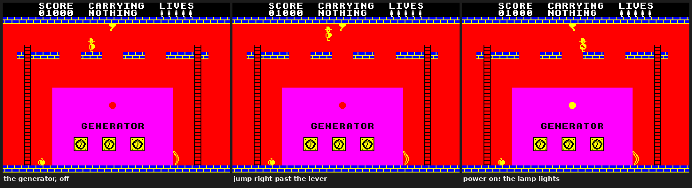

Power drives the toy maker, the egg maker, the train and the lifts, and
nothing else. Turning it off later doesn't undo anything already made,
though it does send the train back to room 74.

### The toy

Drop the eight toy parts into the toy maker's hopper in room 95. Each one
lights up in the machine's window. When all eight are in and the power is
on, in either order, the toy appears in front of the machine: 20,000
times the egg number and a life. The toy-parts basket works here too.

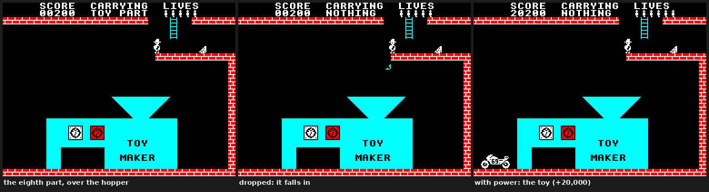

### The egg, and dispatch

Carry the toy to the egg maker in room 48 and drop it on the right-hand
side, where it says PLACE TOY HERE (the code only asks that Harry be at
column 16 or beyond). With the power on and all three vats full, the toy
disappears and the egg appears: another 20,000 times the egg number and a
life. The egg turns up whenever the last of those conditions is met, so
the vats can be filled after the toy is placed.

Then carry the egg (it's big: four cells tall and three wide) to room
111, dispatch, and walk into the truck. That's 30,000 times the egg
number and a life; the truck drives off, the screen says EGGS DELIVERED,
and the next egg begins.

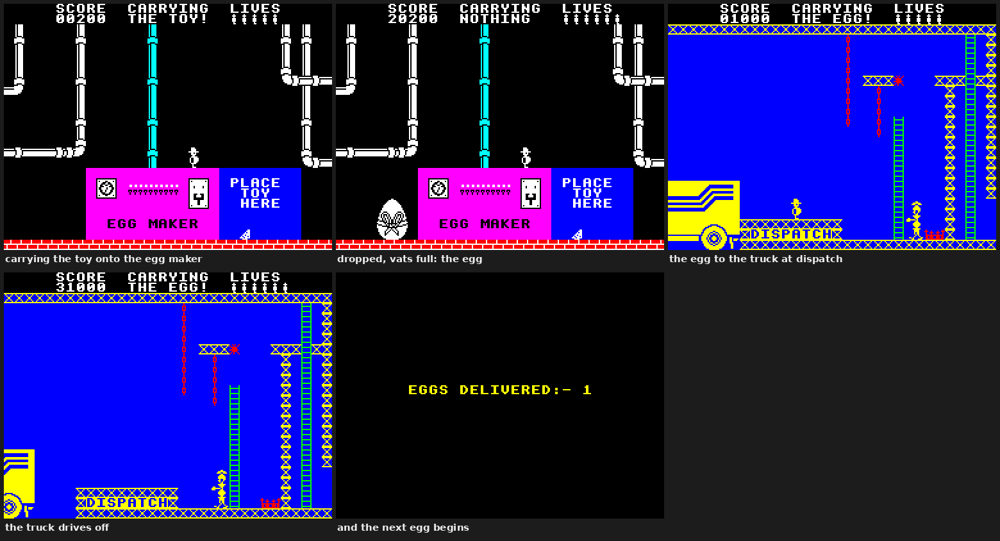

### The rest

- **The dog** in room 2 runs at Harry and kills him. It sits down for good
  the first time something blocks it: the edge of the screen, a gap, or a
  thing in its way, such as the bone from room 11 dropped in its path.
  Waiting at the far right of room 2 until it reaches the left edge works
  too. Either way the bone vanishes.
- **The girder** in room 96 can't be carried. Stand on it with empty hands
  and press TAKE, and it swings into the gap in the floor (Harry drops
  onto the floor below); do it again, standing on it in the gap, and it
  swings back, dropping him through. Dying puts it back where it started.
- **The ladder** in room 109 can be carried (only while standing) and
  dropped, and Harry can climb it wherever it's put.
- **The LIFT** in room 105 is a joke: touch its sign and it says OUT OF
  ORDER for the rest of the egg.
- **The MIXER** (room 38) and **the BOILER** (room 106) are scenery.

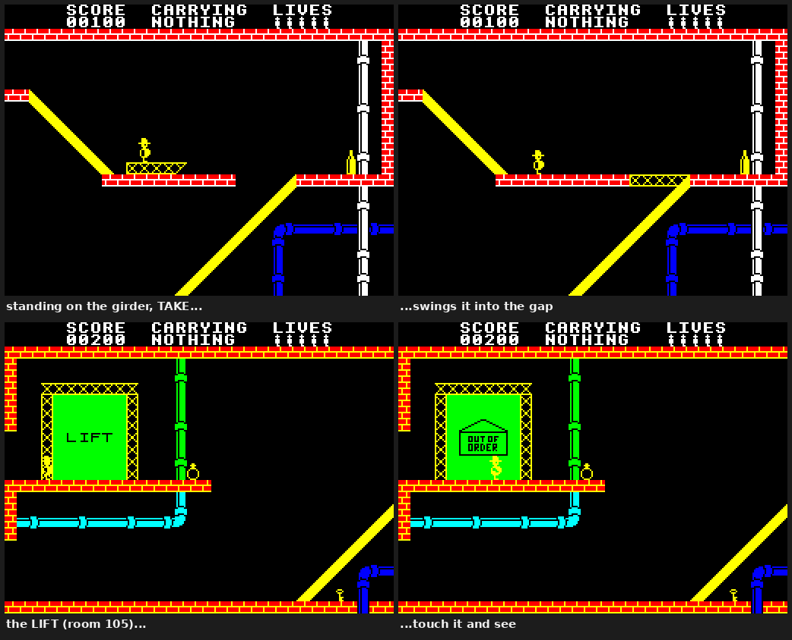

## Egg after egg

There is no ending. After each delivery the factory resets: every thing
goes back to its starting place, the bonus items and the room visit
bonuses come back, the flags and counts clear, and Harry starts again in
room 1 with his score and lives. Three things change (`egg_init`):

- **More monsters.** The first egg enables monster table entries 1-155; each
  egg adds 25 more until all 255 are on at the fifth. They're new monsters
  in new places, not faster ones. (Entry 0 is the sitting dog, which the
  dog's event switches on.)
- **A different toy.** The parts and the finished toy are a motorbike for
  the first egg, then a car, a boat and a jet, then round again.
- **Bigger scores.** Every reward is multiplied by the egg number.

## The main loop

The game runs in passes of exactly three frames, 50 frames a second, so
16.7 passes a second, in every room (`game_loop`, the original's `&77B9`).


Harry moves once a pass and is drawn once, at the start of the next
frame; the monsters tick twice and are redrawn after each tick; the
collision test runs twice, each time just after the monsters have been
redrawn, because it reads the screen.

On the Spectrum the drawing is done by the frame interrupt, and the main
loop's three HALTs wait for it. On the BBC the interrupt only keeps time
and changes the palette, and the main loop does the drawing itself after
each wait for the vertical sync (`draw_frame`), in the same order. The
port keeps the three frames everywhere: the longest stretch between waits,
in any room, is about 28,000 cycles of the 40,000 a frame allows
(`tools/frametime.mjs`, decision 26).

## How it was made to fit: the BBC side

The rule for the port is that the original is the specification: its
tables, its constants and its logic, transcribed. Where the BBC forces a
change, the change is a numbered decision. These are the big ones.

### The screen

The Spectrum's screen is 256 x 192 pixels with two colours per character
cell. The BBC's MODE 1 has the right sort of pixels, four colours, and is
320 pixels wide, so the port narrows MODE 1 to 256 pixels (64 bytes across)
and 24 rows by reprogramming the 6845 CRTC, and moves the picture so it
stays centred (decision 1). Every graphic and every room carries over
pixel for pixel, the screen takes 12K instead of 20K, and a character row
is 512 bytes, which makes the address arithmetic cheap.

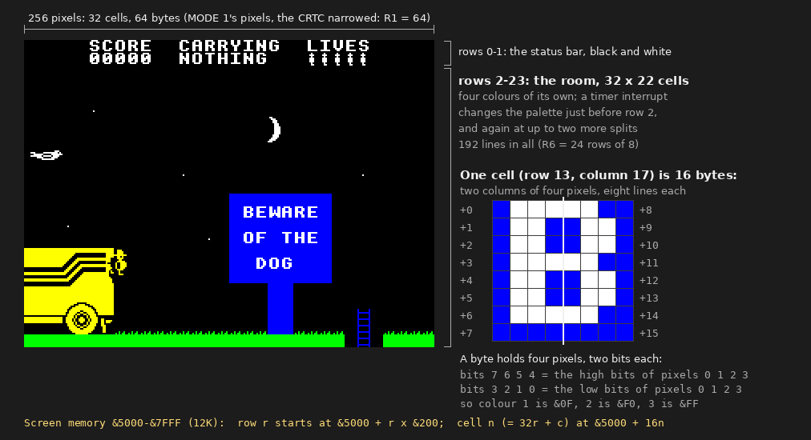

The game sets this up in the hardware rather than through the OS
(`init_system`), because an OS mode change would clear memory the game
needs (see the front end, below).

### Colour

MODE 1 has four colours on screen at once; the Spectrum shows eight, two
to a cell. So each room gets four colours of its own, chosen offline by
`tools/mkrooms.py` from the original's own pixels (decision 2). Logical
colour 0 is the room's background; logical 3 is Harry's yellow (white in
18 rooms where that shows more of the room in its right colours, decisions
6, 18 and 24); every Spectrum colour is mapped to one of the four by brute
force, under rules: ink and paper must stay different in every cell the
room draws, and every colour must differ from the background, so that
nothing can disappear into it.

The status bar is white on black, which many rooms' four colours don't
include, so it has its own palette: a timer on the User VIA interrupts
just before row 2 and changes the palette in the horizontal blank, every
frame. Rooms that need more than four colours get up to two more of these
**splits** (decision 15, an idea of Rich Talbot-Watkins's and Matt's):
below a split, logical colour 2 shows a different colour, and the drawing
maps Spectrum colours afresh for those rows.

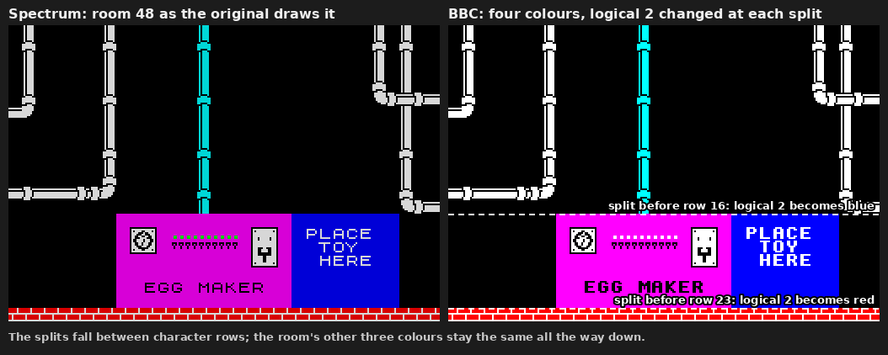

Only one colour changes at a split because of a quirk of the BBC's video
ULA: in MODE 1 a pixel's palette entry also depends on bits of its
neighbours, so each logical colour has four entries. Changing one colour
is four writes, which fit in the 32-microsecond horizontal blank; two
colours would need eight, too many to fit reliably with the interrupt's
jitter. A split is also never put where an object would straddle it and
change colour halfway (decision 24). In all there are 49 splits in 35
rooms, and 99.48% of the rooms' pixels show in their original colour.

### Owning the machine

Once the game is running it owns the BBC outright (decision 11). Its
interrupt handler takes over IRQ1V and listens only to the vertical sync
and the User VIA timer for the splits. It makes no OS calls at all: the
keyboard is read straight from the System VIA, the sound chip is written
directly, and parts of the OS's workspace in pages 1 and 2 hold the
game's tables. The stack keeps only its top 64 bytes; the deepest it was
ever measured to go is 22 bytes (decision 19).

There is one thing the game leaves alone: the OS memory that a soft
BREAK reads, so that BREAK in play comes back cleanly to the menu
(decision 22).

### Sprites

The original ORs a sprite onto the screen and sets the ink of every cell
it covers, which is where the Spectrum's colour clash comes from. The BBC
can draw a sprite in its own colour without touching the scenery's
colours, so the port draws each sprite masked, in its own colour, looked
up for the band each character row is in (decision 9). It erases them the
original's way: under the old picture's pixels only, the room's pixels are
put back from the tile and attribute maps.

Because the sprites are drawn and erased as the original's are, in the
same order, the BBC's screen holds the same sprite pixels the Spectrum's
does, holes and all, so the collision test can read the screen just as the
original does (decision 10). A pixel counts if it isn't the cell's paper,
the tile's own or Harry's.

For speed the frames are stored a column at a time, so the drawing just
steps down a column (decision 20); and to save space, each frame leaves
out its empty top and bottom lines, and frames that are mirror images of
others are stored as a 4-byte pointer to their twin, drawn turned over
(decision 26).

### Memory

Beside its 12K screen, the port's code and data come to about 32K, and a
Model B has about 20K beside that screen ([stock-b.md](stock-b.md) has the
budget). So the port needs a BBC with 16K of sideways RAM, or a Master
(decisions 3, 8 and 16). The data that doesn't change lives in a
sideways RAM bank, which the game pages in and leaves paged in, so it
reads like ordinary memory at `&8000`.


Getting there took a good deal of measuring and packing: the rooms
(decisions 5 and 21), the sprite frames (decision 26), reading text
straight from the OS ROM's font instead of copying the Spectrum's
(decisions 4 and 14), and moving the most used variables into zero page
(decision 19).

### The front end, and the way back to it

The original's instructions, menu, high-score table, key redefinition and
tape saving didn't fit beside the game, and saving to disc needs the OS
and the disc filing system, which the running game has pushed out. So the
front end is a separate program, `MENU`, in MODE 7, with the original's
text where the original put it (decision 13). It finds a free sideways RAM
bank, loads the game's data into it, and runs the game.


Getting back is the clever part: the game resets the machine. It copies
its state (zero page, LowState, the things and the monster table) to a
block of memory a reset leaves alone, writes why it stopped into a
mailbox in the sideways bank (game over, abort, or save), puts back the
OS bytes it borrowed, sets the start-up option that makes BREAK boot the
disc without SHIFT, and jumps through the reset vector. The disc boots,
`MENU` runs, reads the mailbox and carries on: it checks a game-over score
against the table, or saves the game to disc and runs the game again,
which picks up from the block exactly where it left off, just as the
original carries on after its tape save. On a Master the loader prepares
the reset a little differently (decision 16).

The menu has the original's developers' cheats too, hidden behind f0
(decision 27).

### Sound

The original has three sounds, all on the beeper: a tick while Harry
moves, the train's crackle and the life-lost tune. The port plays them on
the BBC's SN76489 sound chip (decision 12): the tune on one tone channel,
each note's pitch and length measured from the original; the tick as two
cycles of another tone channel at the original's pitch, which changes with
Harry's state; and white noise for the train. The tune is timed on the
User VIA's second timer, so the palette splits carry on while it plays.

## How the port is kept faithful

"Measure, don't recall" is the project's motto, and most of the effort
goes into checking the port against the original as it runs.

### The Spectrum as an oracle

The original runs headless on SkoolKit's Z80 simulator (`tools/zx.py`),
driven by the same kind of key scripts as the BBC (`tools/play.mjs`).
`tools/zxrooms.py` calls the original's own room drawer for every room and
keeps the screen and the three maps it built: the oracle. The port's room
viewer draws every room too (`tools/roomcheck.mjs`), and `tools/roomcmp.py`
insists that the three maps match byte for byte and that every pixel is
in the logical colour its Spectrum colour maps to. All 120 rooms pass.

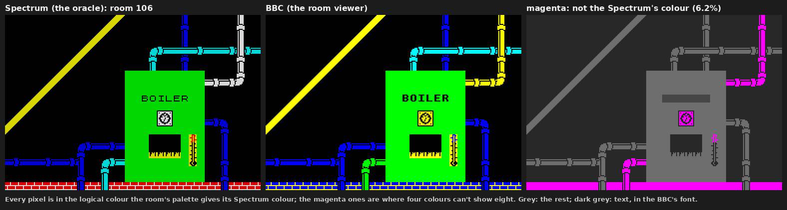

### Pass by pass

`tools/passlog.py` plays the original and `tools/passlog.mjs` plays the
port with the same keys held over the same passes, and both log, at the
top of every pass: Harry's room, cell, `yf`, `xf`, state, facing, jump
count and fall counter; every monster; the random number generator; the
score, lives, carried thing, factory flags and the round robin's state;
the falling thing, the train, and the room of every portable thing.
`tools/passcmp.py` compares them. `tests/scenarios.txt` holds 22
scenarios, from the opening jump out of the truck to dying four times at
the dog, riding lifts, delivering an egg and the cheats. A scenario can
start Harry anywhere with the power on, the factory in any state and a
thing in his hands, set up the same way on both machines.

Scenarios only catch what they reach. One bug stopped the egg from ever
being made: the toy dropped on the egg maker never counted. It was found
by reading the code, during a pass to make it smaller, because no
scenario had ever reached the end of an egg. The `toy-egg` scenario
covers it now, and the lesson is one of the project's rules: every
outcome of the game's machinery deserves a scenario.

### Fuzzing

`tools/fuzz.py` stands Harry somewhere random (a spot with two empty cells
over a floor) in a random room, holds random keys for random spells, and
compares 150 passes on both machines. It found a bug no scenario
reached. In room 80, walking left from column 0 of row 16, the original's
Harry stops: its wall test adds to the low byte of an address only, so
the cell "to the left" wraps round to the last cell of that page of the
map, row 23's column 31, which is solid. The port had stepped into the
row above. Now it wraps too. Another wrap of the same kind, in Harry's
sideways step during a jump, turned up later, once the loggers were fixed
to hold a key through every range a scenario gives it (they had been
holding it only in the last).

### Pixels and speed

When the drawing code changes for speed, `tools/screencmp.mjs` runs the
old and new builds side by side and compares the whole screen at every
wait for the vertical sync: not one pixel may change, because the
collision test reads the screen. `tools/frametime.mjs` measures the cycles
between waits in every room, to keep every pass inside its three frames.

`make check` runs the lot (the rooms, the scenarios, the front end and the
sound), and `make check MODEL=Master` runs it all again on a Master 128.
