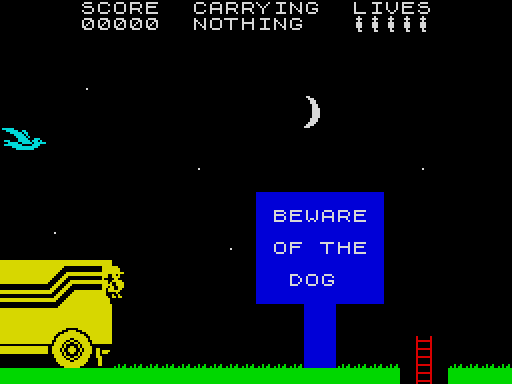
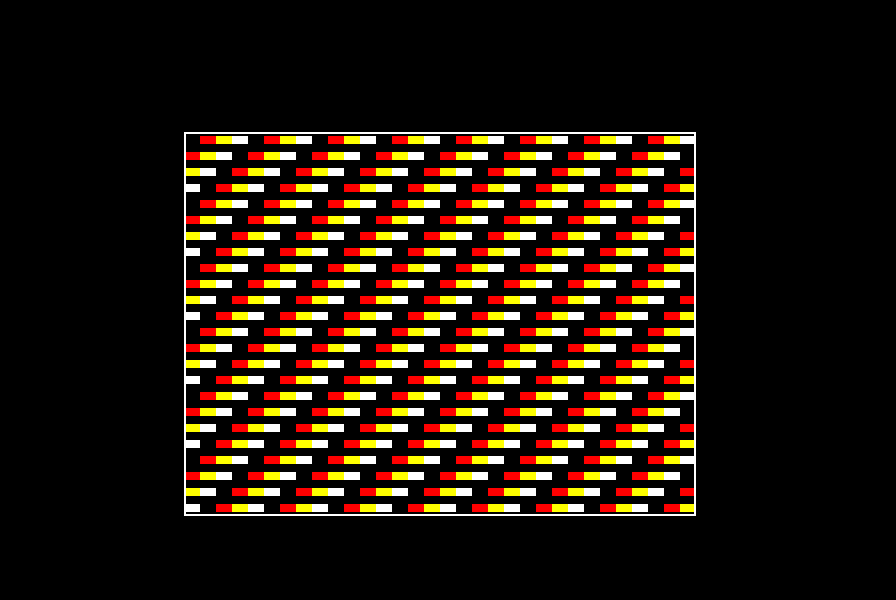
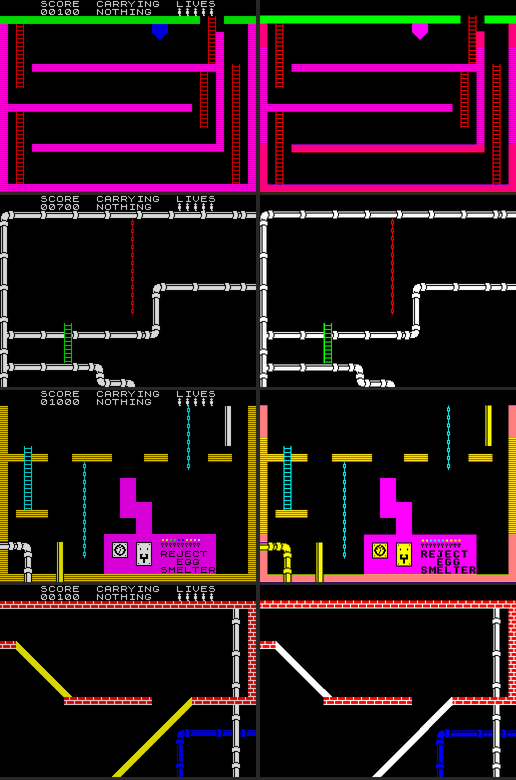

# Journal

What worked, what I found, what went wrong — in the order it happened.

## 2026-10-04: setting up

### Looking around first

- **Sibling projects.** `../beeb-scorched-earth` is the template for the
  repo: baron, a `Makefile`, `tools/beeb.mjs` (a client for the published
  `jsbeeb-mcp` server over stdio) and `tools/play.mjs` (key scripts with
  `!shot` capture points), `CLAUDE.md` holding the gotchas. `../daredevil-demis`
  and `../frogman` taught the same habits in beebasm: dump state rather than
  squint at screenshots; keep the OS out of the game loop; hook IRQ1V
  for vsync. `../pipeline-disasm` is the disassembly-to-baron discipline.
- **kieranhj/beeb-port-kit** is the method from two C64 ports (Paradroid,
  Edge Grinder). The rules I'm taking: *the original is the specification*
  (transcribe its tables and logic, don't reinvent); *measure, don't
  recall*; *one layer at a time, visible in the emulator*; *verify against
  the buffer, not the screenshot*; *decisions are numbered and written
  down* (`docs/decisions.md`). Its baseline machine is a Model B with
  16K of sideways RAM, and it warns RAM is tight for the whole port.
  Normally decisions are agreed with the owner first; here I've been
  asked to make the calls myself, so each one is written down with its
  reason, for review.

### The original

- Spectrum Computing (ZXDB 959) has the tape (TAP and TZX), four full maps,
  the inlay text, a POK file and the AY music. None of it is committed:
  `tools/fetch_original.sh` downloads it and checks `original/SHA256SUMS`.
- **The tape is trivial**: a one-line BASIC loader (`CLEAR 65520`, a couple
  of POKEs, `LOAD ""CODE`) and one 48,896-byte block loaded at 16384 — over
  the screen, the system variables and the BASIC program itself. No
  protection. SkoolKit's `tap2sna.py` simulates the load and stops with
  the game running at `PC = &60C2`.
- **The maps are 10 x 12 rooms of 256 x 176 pixels**: 22 character rows of
  playfield. In the game, the top two rows are the status bar (SCORE,
  CARRYING, LIVES).
- **The POK file names addresses**: lives at 41978, the start screen
  (1-120) at 41982, immunity at 35369. Free landmarks for the disassembly.

### Tools

- No Spectrum emulator was installed, and no pip. A project venv made with
  `uv` holds SkoolKit 10.1 and Pillow (`make venv`).
- `tools/zx.py` drives the original on SkoolKit's C Z80 simulator with the
  same script language as `tools/play.mjs`: keys by Spectrum name, `!shot`,
  `>snapshot`, pokes and peeks, run-to-address, and an execution map. It
  runs about 15 times real time: the instructions, the menu and the
  first room took 0.6 seconds.

### Memory, first look

A rough survey of the loaded 48K by 1K block (zero bytes, distinct bytes,
entropy, ASCII):

| Range | Looks like |
|---|---|
| `&5B00-&6AFF` | the instructions text (~3K) |
| `&6B00-&A2FF` | code, with tables (~14K) |
| `&A300-&AAFF` | mostly zero: workspace |
| `&AB00-&DEFF` | 6-byte records, repeating patterns: room data? (~13K) |
| `&DF00-&FEFF` | sparse, bitmap-like: graphics (~8K) |

So the original is about 38K of code and data. A Model B with a 12K screen
has about 17K left above `&0E00`, plus odd pages below it. That decides
the target machine more than anything else will, so it waits for the
disassembly to say exactly what is code and what is data.

### Colour, first look

Measured on the full map (`ChuckieEgg2.png`), counting the colours of each
room and of each character row:

- Rooms use 3 to 7 colours: 4 rooms use 3, 27 use 4, 46 use 5, 35 use 6,
  8 use 7.
- Character rows: 92% of them use 4 colours or fewer, 7% use 5, under 1%
  use 6 or more. Only 55 of the 120 rooms fit in 4 colours on *every* row.
- Only 7 of 84,480 cells on the map have more than two colours (where the
  map's author drew sprites over the scenery), so it is a clean attribute
  picture: one paper and one ink per cell.

### The screen geometry

First BBC program (`src/main.6502`): `!BOOT` selects MODE 1, then the CRTC
is narrowed to 64 columns by 24 rows (R1 = 64, R6 = 24) at `&5000`, with R2
and R7 moved to keep the centre where MODE 1's is (R2 = 90, R7 = 30: the
display's centre lands 70 character times after hsync and 168 lines after
vsync, as in MODE 1). That is exactly the Spectrum's 256 x 192 in MODE 1's
pixels, 12K, and a character row is 512 bytes, so moving down a row is
adding 2 to the high byte.

A frame on the outermost pixels shows all four edges; the default palette
comes out as expected (logical 1 = `&0F` red, 2 = `&F0` yellow).

The picture sits low in jsbeeb's screenshot, but that is the screenshot's
crop: by the arithmetic it is centred exactly as MODE 1 is.

Baron 0.4.2 has `ASSERT` built in: the port kit's `MACRO ASSERT` shim is
now a "Reserved macro name" error.

### The room format, and an oracle for it

- The room drawer is `&7920`. Rooms are a small bytecode: a background
  attribute, then commands — runs of one tile, capped runs (pipes), pipe
  bends, diagonals, hoppers, blocks, text, single tiles — until `&00`.
  Every tile placed also goes into three 768-byte maps (attribute, tile,
  cell type) that the rest of the game reads. Details in
  `docs/research.md`.
- `tools/zxrooms.py` calls the original's drawer for each room in turn
  (restore a snapshot, poke the room number, push a sentinel return
  address, run to it) and keeps the screen and the three maps: 120 rooms
  in two seconds. Stitched together they are the published map, minus
  the sprites. That is the oracle: whatever the BBC draws for a room gets
  compared against it.
- All 120 rooms parse: 13,633 bytes, average 114 a room. As one block it
  packs to 7,156 bytes with zlib and 6,256 with lzma; but the game needs
  one room at a time, so the packing has to allow that.
- Matt, mid-session: *"At a push, we could go 'Beeb with sideways RAM' or
  BBC Master. but try to fit this in a beeb first."* Decision 3.

### The rooms on the BBC: 120 of 120

- **Colour, measured.** `tools/colourstats.py` scores colour schemes on the
  oracle's pixels: four colours per room shows 99.5% of pixels in their own
  colour (pixel counts are dominated by paper); changing palette per
  character row would show 99.95%. Per-room palettes win on cost: no
  timing-critical interrupt every 8 lines, and sprites keep their colour.
  Decision 2. `tools/mkrooms.py` picks each room's four by brute force
  under two rules: ink and paper stay distinct in every cell, and every
  colour stays distinct from the background (so sprites in any colour show).
  A first version mapped colours the room data doesn't use to any free slot
  (room 1 sent yellow, Harry's colour, to blue); a small prior weight on
  every colour sends them to their nearest neighbour instead.
- **The drawer is a transcription**, handler by handler, of the original's,
  keeping its two pointers (attribute/screen and cell type) as cell numbers
  so its quirks come out the same. One gift from the narrowed screen: with
  16-byte cells and 512-byte rows, cell *n* is at `screen + 16n`.
- **Text uses the MOS font** at `&C000` (decision 4): the Spectrum's ROM font
  isn't ours to copy, and reading the BBC's costs nothing.
- `tools/roomcheck.mjs` pokes each room number into the viewer, dumps the
  three maps and the screen; `tools/roomcmp.py` compares them with the
  oracle: maps byte for byte, and every playfield pixel in the colour its
  room's palette gives the Spectrum's.
- **Bug 1: the OS was writing into my tile map.** The maps live in OS
  workspace pages (`&0400-&0CFF`), and the tile map's middle page is
  `&0800`, the OS's sound workspace. Measured: 27 bytes in `&080C-&083F`
  change every second with no sound playing — the 100Hz interrupt's sound
  processing. Stopping the System VIA's timer interrupt stopped it (negative
  INKEY scans the keyboard itself, so it still works). The game will own
  the interrupts outright anyway, as the port kit does.
- **Bug 2: a run's tile and type were the wrong way round.** The run
  handler pushes the command byte, then two data bytes, and pops them
  crosswise: the *command* is the tile (`&2C-&5F`, which is the font's
  range) and the last byte is the type. The tile and type maps disagreed
  in exactly mirrored cells, which made it obvious.
- After those, **all 120 rooms match**. The viewer (Z/X or the cursor keys
  step through rooms) is 16,768 bytes with the room data raw: 128 bytes
  under the screen.

Room 70 is the worst for colour (91.4% of pixels in their own colour):
its red and yellow brickwork comes out magenta and yellow.

### Packing the rooms

- General-purpose compression doesn't see the rooms' structure. Per-room
  ZX02 (the port kit's packer) took 13,633 bytes to 10,220; a shared
  dictionary of whole rooms, which ZX02's `skip` allows, only to 9,671.
- Measured instead: a room averages 2.7 distinct brushes (tile, attribute,
  type); those fields repeat from one record to the next about 80% of the
  time; positions and lengths carry 4.2-5 bits of entropy each, close to
  their fixed widths. So `tools/packrooms.py` writes a bit stream per room:
  a prefix code for the command class (a run is one bit), move-to-front
  lists for attribute, tile and type, fixed widths for the rest, fields in
  the bytecode's own order so the unpacker emits each as it goes. 7,770
  bytes, round trip checked for every room. Decision 5.
- **One record in the whole game says column 32** (room 33). The original's
  arithmetic carries it into row 12, column 0; it is packed as that, and
  the round trip compares against the room with that record normalised.
- `src/unpack.6502` turns a room back into the original's bytecode in a
  385-byte buffer and the transcribed drawer draws from it, unchanged.
  Still 120 of 120 against the oracle; 5,103 bytes free under the screen
  where there were 128.
- Baron: `ZA_INDEXEDBY` belongs to the instruction just before it, so an
  indexed load and store on one line need a line each; and it didn't like
  `mtf-1,X` (Argument out of domain): index from the array's own address.
- Matt asked for a work-in-progress disc in the repo, linked from the
  README so the current state can be seen in a browser: `make wip`
  copies the build to `chuckie-egg-2-wip.ssd`.
- **How long a room takes**, by breakpoint pairs on the cycle counter
  (`read_registers`' `elapsed_cycles`): palette and screen clear 137K cycles
  (the clear alone is 68 ms: an `STA (p),Y` loop over 12K), unpack 33-76K,
  draw 105-246K; 275-446K in all, 0.14-0.22 s. The Spectrum's drawer takes
  96-140 ms for the same rooms (T-states in SkoolKit, uncontended). Fine for
  flipping screens; an unrolled clear would win back ~37 ms if needed.
- `docs/memory-map.md` started: with the rooms packed, 5,103 bytes are free
  under the screen. The original's code is ~14K and its graphics ~8K, so
  the memory budget is the next problem.

### The interrupts, and a palette split for the status bar

- The status bar is white text on black; many rooms have neither in their
  four colours. So rows 0-1 get their own palette: `src/irq.6502` now owns
  IRQ1V outright (after the port kit's `lib/irq.6502`: both VIAs silenced
  but VSync and the User VIA's T1). At VSync it writes the status bar's
  palette and starts T1; when T1 fires it writes the room's: logical 1-3
  first, during the last scanline of row 1 (blank in an upper-case font),
  then logical 0, aimed at the horizontal blank before row 2.
- **Measured, by making the status paper red** and finding where the red
  stops in jsbeeb's screenshots (4 screen pixels per scanline here). First
  try: 188 pixels into line 14. MODE 1 runs with interlace sync on, which
  moves VSync half a line in alternate fields — a 32 µs swing against a
  32 µs blank — so R8 is now 0, as `*TV 0,1` would set. After that the
  switch point held to within 8 pixels (1 µs, the interrupt latency)
  frame to frame. Retuned: `SPLIT_T1 = 83 * SL - 2 + 46` puts the red on
  exactly lines 0-15 in every frame sampled, with the logical-0 writes
  about 4.5 µs into the blank and done 11.5 µs before row 2.
- jsbeeb only. The port kit's experience is that raster timing wants
  checking on a second emulator (b2) and on hardware; noted for later.
- With the OS's interrupt gone, OSBYTE 129's negative INKEY still reads
  the keys in the viewer: it scans the matrix itself.

### Research: the front end, controls and sound

Four research agents were set going on the disassembly at once (Harry;
objects and game logic; monsters, sprites and graphics; front end and
sound), each writing its own `docs/research/*.md` and a SkoolKit control
file in `disasm/`. The front-end one came back first
(`docs/research/frontend.md`). What changes the plan:

- **Three sounds in the whole game**: Harry's movement click, the train's
  noise and the life-lost tune. Menus, pick-ups, eggs: silent. Easy work
  for the SN76489.
- **The main loop runs in 3-frame passes.**
- **No pause key**; the eight keys are abort, take/drop, save, the four
  directions and jump.
- **Saving writes the whole game state** (1,320 bytes, XORed with the
  random number generator) to tape, at any time, from play or the menu.
- **There is no ending**: delivering an egg shows "EGGS DELIVERED:- n" and
  starts the next with more monsters. No competition code anywhere.
- **Sizes**: 1,511 bytes run once at start-up (the instructions), about
  1,560 between games (menu, redefine, high scores, save/load), 810 in
  play. The start-up and between-games code can live outside the
  resident game on the BBC.
- A hidden cheat: a byte at `&FFFF`, outside the tape image and normally
  0, of the form `%101xxxxx` gives a starting egg, a room skip and
  infinite lives; anything else non-zero prints PLEASE TRY AGAIN and
  resets the Spectrum.

### The status bar, and what a MODE 1 palette entry really is

- `src/status.6502` draws the status bar as the original's drawer does
  (`docs/research/frontend.md` §6): `SCORE  CARRYING  LIVES` on row 0, the
  score, the carried object's name and the lives icons (tile `&56`) on
  row 1, all white on black, i.e. logical 1 on 0 in the status palette.
- **The lives icons' feet came out blue**: the icon uses its eighth line,
  so row 1's last scanline isn't blank, and the room's logical 1 was being
  written during it. Fix: change fewer entries at the split, since only
  the entries the status bar can show need to wait for it.
- **Then the letters had coloured pixels in them**, which showed my model
  of the palette entries was wrong. The ULA builds the entry number from
  bits 7, 5, 3 and 1 of a shift register that moves one bit a pixel. With
  a byte's bits `p0h p1h p2h p3h p0l p1l p2l p3l`, pixels 0 and 1 take
  entry bits 2 and 0 from the pixel *two to the right*; pixels 2 and 3
  take one low bit from two to the left and a 1 shifted in. So white on
  black uses logical 0 and 1 beside "neighbours" 0, 1 *and 3*: six
  entries, not four. Now VSync writes the other ten with the room's
  colours, and T1 writes just the six (24 µs) in the blank before row 2.
- Swept the timer across the window with a red status paper
  (`-D SPLIT_SWEEP=n`): the switch is clean from offset 84 to 108 (µs)
  and late at 112; `SPLIT_ADJ = 96` sits in the middle.
- Baron: `IF NOT(DEFINED(X)) : X = ...` never settles (the definition
  flips the test between passes); an override needs its own name.

### Research: Harry

The Harry agent's write-up is `docs/research/harry.md`. The facts the
engine will be built on:

- Harry updates once every **3 frames** (three HALTs a loop; measured
  3.000 in quiet rooms, up to 3.1 in busy ones).
- Walk 2 px an update; fall 4; ladders 2; ropes only slide down (1, 2 or 3
  px by the keys); slopes 2 across and 2 up or down, climbing only while
  the uphill key is held; lifts 2.
- The jump is a table (`&89CF`): 4,4,3,2,1,1,1,0,0,0,0,-1,-1,-1,-2,-3,-4...;
  16 px high, 36 px long on the flat; the direction is fixed at take-off.
- A fall kills if the fall counter reaches 15: from rest, 7 cells is safe
  and 8 kills.
- Cell-type bits: `&01` solid, `&02` ladder, `&04`/`&08` the two slopes,
  `&10` rope, `&20` a pipe that only holds you while you walk ("some pipes
  are more slippery than others"), `&80` deadly.
- His code is 2,530 bytes on the Spectrum, plus ~290 of helpers and 294 of
  sprite frames.

### Build stamp

Matt asked for the build date, time and commit in `!BOOT`, to tell old
discs apart: the Makefile passes `-D BUILD="2026-10-04 14:26 UTC 777ab7a"`
(a `+` after the SHA if the tree had changes) and `!BOOT`'s first line is
`*| CHUCKIE EGG 2 <stamp>`, so `*TYPE !BOOT` shows it. `make wip` refuses a
dirty tree and the disc goes in its own commit, so its stamp names the
commit holding its code.

### Research: monsters, sprites, graphics — and the memory verdict

`docs/research/monsters.md` (with sheets of every sprite in
`docs/research/img/`) settles how the original draws: sprites are ORed
on, setting only the ink of the cells they cover; erasing clears the old
image's bits and ORs back the tile pixels from the tile map, attributes
from the attribute map. Positions are 2-pixel steps with pre-shifted
frames, so nothing shifts at draw time. The main loop is exactly three
frames, always: Harry moves once and is drawn in frame 1; monsters tick
twice and are drawn in frames 2 and 3. At most four monsters a room; 52
types; later eggs enable more table entries (more monsters, none faster).

And its numbers decide the machine. The graphics alone are 9.5K
(monsters, truck, train and lifts 7.5K; objects 1.3K; Harry 0.3K; tiles
0.5K). With everything else the game needs ~20K more than is placed so
far, against 4.5K free under the screen. A stock Model B could only do it
by loading each room's data from disc on the way in, with a pause and the
drive's noise on every screen; so, decision 8, as Matt allowed: a Model B
with 16K of sideways RAM.

Measured in jsbeeb with a probe (page each bank, flip `&8000`, see if it
sticks): the Model B models have RAM in banks 0-7, the Master in 4-7. So
the README's browser link keeps working.

Keys (decision 7): Matt wants the Spectrum's for now — "the spectrum ones
work and are authentic" — with BBC-appropriate ones for later discussion
(`docs/for-review.md`, which lists every call made autonomously that he
may want to revisit). SPACE stands in for SYMBOL SHIFT. Measured in jsbeeb's
`keyboard_state`: 1 is internal key 48, 0 is 39.

Yellow is now one of every room's four colours (decision 6), so Harry is
always yellow; about a point of scenery colour lost on average.

### Sideways RAM, in practice

- The disc now holds three programs: `SWLOAD` loads `CE2DATA` (a 16K image
  assembled at `&8000`) to `&3000`, finds the highest bank that is RAM and
  had no ROM at start-up (ROM type byte 0), copies the image in and
  `*RUN`s `CE2` over itself. `CE2` finds the bank again by the magic at its
  start and leaves it paged in for good (`romsel` and the OS's copy `&F4`
  both): the data reads as ordinary memory at `&8000`.
- The packed rooms moved there: 12,228 bytes free in main RAM, 7,839 in
  the bank.
- **The Master drew garbage for text**: decision 4 read OS 1.20's font
  straight from `&C000`, which isn't where MOS 3.20 keeps it. Now
  `copy_font` reads characters 32-127 through OSWORD 10 into the bank at
  start-up, before the interrupts are taken: the machine's own font, on a
  B or a Master. Checked on both in jsbeeb; 120 of 120 rooms still match.

### Research: objects and game logic

`docs/research/objects.md` completes the set. Everything that isn't
scenery or a monster is one of 256 "things" (room, row, column, type, in
four parallel 256-byte arrays): 41 portable (8 toy parts, 8 each of milk,
cocoa and sugar, 4 baskets, bone, girder, ladder, the toy, the egg), 17
machine parts, 198 bonus items. The game: fill three vats with 8 of each
ingredient, make the toy from 8 parts with the power on, set the toy on
the egg maker with the vats full, deliver the egg to the truck in room
111. Each step scores (10,000-30,000 x the egg number) and gives a life;
the next egg resets the factory, enables more monsters and changes the
toy. The "unless..." of "you only have two hands" is the basket, which
gathers any number of one ingredient (and makes jumps lower).

### Harry, transcribed — and checked pass by pass

- `src/harry.6502` is the original's update (`&80B6-&8A97`) transcribed
  from `docs/research/harry.md`'s pseudocode, with the original's code
  read wherever the arithmetic mattered (the rise and land tests, the
  slope snaps, the room edges). Harry is a cell, yf and xf; T(off) is an
  indexed load from his cell in the type map. Lifts aren't in yet.
- Quirks kept, each because it moves Harry: the snap up a row that gives
  yf 7 instead of 0 where the Spectrum screen's thirds meet; the frame
  picked before the edge code changes xf (one drawing a few pixels off
  after every room change); the `Snap38` that stores the tile number as
  xf and lets `ApplyDelta` turn it into a column.
- `src/sprite.6502`: frames drawn masked in the sprite's colour (yellow for
  Harry), erased by redrawing the covered cells from the maps; that is the
  original's own method, at cell granularity.
- `src/game.6502`: the three-frame main loop, room changes (with 80-71),
  the checkpoint, death (back to the checkpoint, a life gone; the stack
  is reset and the loop re-entered as in the original). Harry's state is
  in fixed zero page outside baron's allocator pool, which would read that
  jump as recursion; the allocator raised no objection.
- `make rooms` now builds a viewer variant (`-D VIEWER=1`) for the room
  check, since the main build plays.
- **The oracle for movement**: `tools/passlog.py` plays the original and
  `tools/passlog.mjs` the port with the same keys held over the same
  main-loop passes, each logging Harry's room, cell, yf, xf, state,
  facing, jump count and fall counter at the top of every pass;
  `tools/passcmp.py` compares. Every scenario tried matches, pass for
  pass: idle (the jump out of the truck and the landing), walking right
  across room 1 and into the ladder gap and down to room 11, jumping on the
  move both ways, holding down at the ladder, walking left into the
  truck's invisible wall, jumping repeatedly. The one difference is pass
  0's fall counter: the original starts a game with 250 there, left over,
  and zeroes it on the first update; the comparison ignores it.
- **A slip, and what it hid.** The Harry commit said `make rooms` gave 120
  of 120; it hadn't run: the viewer build failed (`room` was now defined
  twice) and I committed without reading the output. Fixing that showed 16
  rooms with wrong pixels — all with text — and those came from the test,
  not the game: with the sprites the data image is nearly 16K, loading now
  takes 4.6 s (measured), and the check read the font from the bank after
  a fixed 4 s, while the DFS still had its own ROM paged in. The tools now
  run to a named symbol after booting (`bootUntil` in `tools/beeb.mjs`,
  `--until` in `play.mjs`) instead of waiting a guessed time. 120 of 120.

### Monsters and collisions

- `src/monsters.6502` transcribes the monster code (`docs/research/monsters.md`
  sections 3-4): set-up from the 256-entry table, the two ticks a pass,
  horizontal and vertical movers, the specials (icicles, drips, bubbles,
  clouds), respawn with the dog's and the dinosaur's room events, and the
  RNG, called once per monster per tick as in the original. The records are
  parallel arrays in the DFS's NMI page.
- **The erase is now the original's**: under the old image's set pixels
  only, the room's pixels go back (`erase_image`); everything else on
  screen is left alone. Harry uses it too.
- `src/collide.6502` (decision 9): the original's pixel test asks its
  1-bit screen; here the same question goes to the visible monsters'
  images, masked by Harry's and the tiles' pixels, in his 8-pixel window.
  Then the boxes in record order decide, kill or bounce, and the train's
  rule for rooms 71-80.
- `tools/passlog` now logs the RNG and every monster's record too. Walking
  right through rooms 1 and 11 matches pass for pass, the bird and both
  hedgehogs included, and so does a new scenario: jump room 1's gap, meet
  room 2's dog, die four times (each death back to the checkpoint, the dog
  reset, the RNG in step).
- Main RAM: 6,210 bytes free.
- **A teleport for the tests**: `--start room,row,col,yf,xf,state,face` on
  both pass loggers puts Harry somewhere else before pass 0. On the
  Spectrum the simulator pokes his record and calls the original's own
  room set-up (`&7913`); on the BBC a debug hook at the end of the main
  loop does the same from a block the test fills. Teleported into room 27,
  Harry falls, is knocked back by the crocodile (a bounce: random momentum
  from the RNG), lands on a slippery pipe and walks to a wall: 110 passes,
  identical. Rooms with objects will differ until objects are in: they
  mark their cells in the type map, and monsters treat those as walls.

### Objects, and three bugs that taught something

- `src/objects.6502` transcribes the objects (`docs/research/objects.md`):
  the 256-thing table, footprints in the type map, the round robin and the
  current thing drawn every frame, bonuses (with the RNG's tens and units),
  take, the basket, drop, the hopper fall, the vats, toy maker, egg maker,
  power lever, LIFT sign, girder, dispatch, scoring with its single
  rippled carry, the room-visit bonus, extra lives, the new-egg reset with
  more monsters and the egg's toy. Main RAM: 839 bytes free.
- The pass logs now carry score, lives, carried thing, factory flags, the
  round robin's pointer and selection, the falling thing.
- **A label shadowed a table.** `.visits` as a loop label inside
  `egg_init` made `LDA visits,X` read and rewrite egg_init's own code: the
  game started with Harry a row too high and "carrying" thing 0. Baron
  doesn't warn; `tools/lint_labels.py` now finds every local label that
  shares a global's name, and the build fails on one. It found 22 more,
  harmless only by luck, all renamed. (And a slip of mine: the scoped
  rename also renamed the reference to the table, the one thing it
  mustn't; caught at the next run.)
- **The round robin's pointer belongs to the round robin.** The original's
  footprint routine loads the current-thing record without touching
  `&A400`, and touching and taking act on `&A400`'s thing whatever the
  record holds; my loader set both. And the room drawer resets `&A400` to
  thing 0 on every room draw, deaths included.
- **Collisions now read the screen** (decision 10, revising 9). The dog
  deaths diverged by a part of a pass; my first theory, erase holes, was
  wrong (the original died in the same part), but reading the screen is
  the faithful method regardless: the sprites are drawn and erased exactly
  as the original's are, so the screen holds the same sprite pixels.
- **The real bug was mine**: adding the round-robin reset to `draw_room` put
  `LDA #0` between saving the room number and using it, so every room got
  room 0's palette, and the screen test then saw every pixel as "not
  paper". Before finding that I moved the colour map out of baron's pool,
  suspecting the allocator; it was innocent, but long-lived state belongs
  in the fixed zero page anyway.
- `make check`: 120 of 120 rooms, ten scenarios. New: a bonus pickup
  (+337: 3 hundreds, then 3 tens and 7 units from the RNG) and room 33's
  first-visit bonus. A basket scenario wandered into room 34's lift, which
  isn't in yet: the next layer.

### A RAM pass, first steps

- **The room unpacker streams.** It used to unpack a whole room into a
  385-byte buffer; now the drawer's `fetch` takes bytes from an 18-byte
  record buffer and unpacks the next record when it runs dry (the longest
  record, a text, is 17 bytes). A trace of every byte `fetch` returns for
  room 70 matched the original's bytecode exactly.
- **The 256-byte nibble table went**: the top nibble of b spread is just
  `spread_lo[b >> 4]`, four shifts.
- Main RAM: 1,430 bytes free, from 839.
- **And another test-timing trap**: three big rooms "failed" because the
  room check dumped them a fixed 20 frames after the viewer started
  drawing, and the shifts made drawing a little slower. It now runs to the
  viewer's wait loop. Twice now a fixed wait in a test has passed for a bug;
  `CLAUDE.md` says run to a symbol, and that goes for every wait.

### Machines: the truck, the train, the lifts

- `src/machines.6502` transcribes `&8EE8-&9189`. **The truck** backs in at
  every egg's start (14 steps of 10 frames, the strips growing in from the
  left edge), drives off with a delivered egg, and in rooms 1 and 111 one of
  its seven strips is repainted each pass, as the original repairs the
  holes sprites leave. Matt saw Harry "kick out from thin air": now there's
  a truck to kick out of.
- **The train** runs through rooms 71-80 once the power is on, a position
  step a pass, its front poking into the next room with the opposite
  parity. While it is drawn with the power on, the original's noise
  routine, called nine times a pass, takes a random number each time; the
  port calls `noise` at the same nine places, so the monsters' RNG stays in
  step (the train-runs scenario: 200 passes, two rooms).
- **The lifts**: room 26's and 55's bars rising for ever, room 34's and
  104's platforms that sink while Harry rides them. Harry's state 8 is in:
  landing on a lift from a fall or jump (within 2 pixels above to 3 below
  its top), riding it, walking off either end, crushed by a solid cell at
  the head. The room 24 basket scenario that wandered onto room 34's
  platform now matches all 120 passes.
- **A sprite bug older than this layer**: frame numbers from &80 doubled
  with `ASL A : TAY`, losing the top bit, where the original carries into
  its high byte. The truck (&80-&89) and lifts (&96, &97) showed it, and so
  would have the monsters of 19 rooms (types with base frames 138 and 142:
  rooms 13, 40, 60, 63 and more), drawn with the wrong frames and
  collided with the wrong boxes. `sprite_frame` does the lookup now; the
  high-frames scenario (room 13) covers it.
- **Main RAM ran out** by 32 bytes, with sideways RAM nearly full too
  (decision 11): the keyboard is now read straight from the System VIA, so
  nothing calls the OS during play, and pages 1-3 hold three constant
  tables copied in at start-up. 395 bytes free. The eggs-delivered wait,
  which used OSBYTE 122, now copies the Spectrum's LAST K behaviour: a new
  press, or a held key once it would repeat (35 frames).
- **Test tools**: `--power` on both pass loggers (the lever's power on at
  the teleport), the train's room and position compared each pass, and
  `--peek sym:len,...` on the BBC logger for debugging. A trap: my first
  `--power` poked at the top of the room-1 pass, one pass early, so the
  BBC's train was a step ahead; the RNG counts per pass showed the
  original lagging by exactly one.
- The original's main loop clears the current-object record at the end of
  part 0 (`&7864`), so the frame interrupt after part 0 draws no object;
  the port drew it there. Now it doesn't.
- `make check`: 120 of 120 rooms, 15 scenarios (new: lift-ride,
  high-frames, train-still, train-runs, lift-rises).

### The dog takes the bone

- When room 2's dog is first blocked it sits for good, and the original
  deletes the bone wherever it is (`&8D4D`): its footprint toggled in the
  *current* room's map at the bone's row and column (a stray `&40` in room
  2 when the bone is elsewhere, kept), its image erased. Now in.
- So the way past the dog, which Matt couldn't find in the objects-less
  build: the dog runs left from the middle of room 2 and sits at the first
  block, an edge or the bone dropped in its path. Waiting at the room's
  right-hand end works too.
- The pass logs now carry every portable thing's room (things `&00-&28`),
  so a thing taken, dropped or deleted is compared each pass. dog-sits:
  Harry waits at column 28, the dog sits at column 0 and the bone goes at
  pass 151 on both.

### Sound, and deaths you can see

- Matt: "no fall death yet". It was there, but instant: the original
  plays its life-lost tune first (2.16 s, interrupts off, everything
  frozen), and without it a death was a blink. `src/sound.6502` (decision
  12) plays the tune on the SN76489 through the System VIA's slow bus,
  timed on the User VIA's timer 2 so the palette split carries on. A run
  into room 2's dog: 34 chip writes (volume, 16 notes, off) and 2.19 s from
  the death to the room's redraw.
- The movement tick: two cycles at the original's pitch, which follows
  Harry's state (walking is N = 76, measured in the emulator), twice a
  pass while he moves. The train's rumble: white noise at the original's
  sample rate while the train is drawn with the power on.
- RAM again: the font copy is trimmed to characters 32-95 (nothing prints
  beyond Z) and the packed rooms' offset table moved into sideways RAM.
  Main RAM 252 bytes free, sideways 89. The room viewer, which the room
  check builds, had stopped fitting at 17.

### Packing the rooms tighter

- The move-to-front escapes were a quarter of the packed rooms: a value
  not among the last three of its field cost 3 + 8 bits, and there were
  1,357 of them. But in the whole game the attributes take only 38 values,
  the tiles 49 and the cell types 8. An escape is now an index into its
  field's vocabulary, 6, 6 and 3 bits: 7,770 bytes down to 7,289, plus
  109 bytes of tables. Sideways RAM: 461 bytes free.

### A front end, and a way back to it

- The original's front end didn't fit in the game: about 240 bytes of main
  RAM were left, 460 of sideways RAM, and saving and loading need the OS
  and the DFS, which the game has pushed out. So the front end is a
  separate MODE 7 program, `MENU` (decision 13, Matt's MODE 7 loader idea
  taken further), with the original's instructions, menu, high-score table,
  name entry, redefine keys, and load and save, now to disc. Its text comes
  from the tape (`tools/mkfront.py`) and sits where the Spectrum put it.
- **The way back is a reset.** The game puts its state in a block at
  `&5F00` and why it stopped in a mailbox in the sideways bank, puts back
  what a soft BREAK keeps of OS page 2, flips start-up option bit 3 so that
  BREAK boots without SHIFT, and jumps through the reset vector. `!BOOT`
  runs `MENU`, which flips the bit back. Matt: "it's not too clever - it's
  a great idea".
- Getting the reset to come back took reading OS 1.20's reset code and
  DFS 1.2's service handler in the emulator rather than guessing:
  - junk in `&0258` (`*FX 200`) made the reset clear memory;
  - junk in `&028F` chose the screen mode the reset selects: MODE 2, whose
    screen at `&3000` wiped the state block;
  - the BREAK intercept runs before the DFS claims the machine, so the
    boot is better left to the DFS: flipping bit 3 of `&028F`, which a soft
    BREAK keeps, makes it boot as SHIFT-BREAK does;
  - the reset came up in the cassette system twice: once I blamed the
    loader's `*TAPE` (removed anyway, as the game never calls the filing
    system), once port A (the sound writes leave it all outputs); the real
    cause was **a key held through the reset**, the abort key itself, which
    makes the DFS decline the boot. The handoff now waits for every key to
    be released, SHIFT and CTRL included.
- Save in play: the game hands over, `MENU` writes the file and runs the
  game again, which carries on from the block: Harry, the room, the
  monsters, the things all as they were, and the RNG where the original's
  cipher leaves it (`5D 00 07 B1`). The RNG also carries over between games
  through the mailbox, as the original never reseeds.
- RAM: the game's scratch variables moved into zero page `&90-&F2`, free
  once the game owns the interrupts (decision 11), saving their bytes and a
  byte on every access; the score, lives and carried name moved into
  LowState so the state block is a few whole regions. Main RAM 251 bytes
  free, sideways 172.
- The display stays blank (CRTC R8) from start-up until the first room's
  screen is cleared, and the game sets MODE 1 in the hardware: `MENU`
  leaves the OS in MODE 7, and an OS mode change would clear the block.
- `make front` (`tools/frontcheck.mjs`) drives it all on the release
  disc: the instructions, redefining the keys (a repeat refused), playing
  with them, saving and carrying on, aborting, loading, and game over with
  a new high score and its name. The tools now use `build/test.ssd`, whose
  `MENU` goes straight into a game. Bugs it found: two routines sharing
  `MENU`'s zero page (a counter clobbered by the line printer), the ©
  sign being DELETE to OSWRCH, and two test-timing traps of my own: a key
  pressed while `MENU` was still starting, and "menu ready" judged by the
  build stamp, which the OS also prints when it echoes `!BOOT`.
- Not yet: the Master (its reset ends in "Acorn MOS" and hangs), a joystick.

### Fuzzing

- `make fuzz` (`tools/fuzz.py`): Harry stood somewhere random in a random
  room, random keys held for random spells, 150 passes on both machines,
  compared pass by pass. Seeds 1 and 2: 39 of 39 compared cases match, in
  35 rooms the fixed scenarios never visit; 3 skipped, where the start was
  deadly and the original's game ended before there was anything to
  compare.

### The font from the OS ROM

- The game read text from a 512-byte copy of the MOS font in sideways RAM,
  made at start-up so that a Master (whose font isn't at `&C000`) would
  work too. But the Master's reset doesn't come back to `MENU`, and Matt's
  target was a Beeb first. Decision 14: a Model B, text straight from OS
  1.20's ROM at `&C000`. Sideways RAM: 689 bytes free; main RAM 322 (the
  copy routine went too). Rooms, scenarios and the front end all pass.

### Palette bands

- Rich TW asked twice for raster colours, and room 48 shows why: its four
  colours (black, magenta, blue and the yellow forced in for Harry) turn
  the white and cyan pipes, the red bricks and the green dots into yellow
  and magenta. Decision 15: up to two splits a room between playfield
  rows; below each, logical colour 2 shows another colour and the
  Spectrum's colours map onto the four afresh.
- Measured first: one free colour per band with two splits gets 99.4% of
  the pixels in their own colour against 99.5% for two free, and needs 4
  ULA writes (16us) per split instead of 8, which wouldn't fit the 32us
  horizontal blank with jitter. `tools/mkrooms.py` chooses the splits,
  keeping one only for a 0.2% gain: 93 splits, 97.8% becoming 99.0%.
- The drawing looks the colour map up by the cell's row (tiles, cell
  colours for erasing and collisions, the truck and train strips); sprites
  take a Spectrum ink and resolve it each character row, so a monster
  crossing a split changes colour as its cells would.
- The interrupt: T1 now runs free, VSync starting it and latching the
  period to the first band, each split latching the one after next, so
  every split carries only VSync's latency. `tools/bandsweep.py` measured
  the window in room 48 (whose splits have colour at both edges): clean
  from -20 to +4us, set at -8. The first sweep's negative values came out a
  whole row late: my latch arithmetic didn't borrow into the high byte.
- RAM: the band records are 4 bytes (row and colour share one) and live in
  sideways RAM with the band tables; main RAM 130 bytes free, sideways 36.
  This used the 512 bytes the font copy freed (decision 14), which Matt now
  wants back for the Master: being looked into.

### Keeping up: three frames a pass

- The original's main loop is three HALTs, a pass every 3 frames, and it
  keeps to that in every room measured (`run_tstates` between passes on
  the Spectrum: an average of exactly 3). `tools/perf.mjs` found the BBC
  taking 4 frames for some passes in about a dozen rooms, up to half of
  them in room 56: slower than the original there. It predated the bands
  (measured on the commit before: the same).
- `tools/sample.mjs`, a sampling profiler, put most of the time in
  `cell_looks` (a cell's tile and colours), called by `erase_image` for
  every non-empty sprite byte of every line and by the collision test for
  every line of each of Harry's columns, though a cell serves eight lines.
  Sprites are now erased a column at a time (the bytes are independent),
  looking a cell up once per cell row, and the collision test keeps the
  last cell for each column. Room 56 holds 3 frames now; rooms 85 and 97
  still take 4 for 1 and 2 passes in 20.
- RAM: the game no longer searches the banks for its data with a 33-byte
  magic; MENU, which has just found or filled the bank, leaves its number
  in zero page `&8F`. Main RAM 124 bytes free.

### The Master back

- Matt: "Master support is important as I only have a physical Master to
  test on". A subagent investigated in its own worktree, disassembling MOS
  3.20 and tracing its reset in jsbeeb, and came back with a working
  patch (decision 16):
  - The font: MOS 3.20 keeps it in bank 15 at `&B900`, byte for byte OS
    1.20's, but the data bank must stay paged in (the interrupt reads the
    bands from it). So on a Master the loader builds the font through
    OSWORD 10 and copies it into HAZEL at `&C000`, and HAZEL stays paged
    in: the game's font address doesn't change. Matt's self-modifying
    patch wasn't needed.
  - The reset hung because MOS 3.20's soft BREAK trusts what the game had
    overwritten: an EXEC handle of `&82` from `thing_types` in `&0256`
    sent it into a BRK loop; `&0355` chose MODE 5, which would have wiped
    the state block; a junk extended vector under LowState jumped to
    bank 0. The loader now snapshots pages 2, 3 and `&0D` into HAZEL,
    and `master_reset` puts them back before resetting.
  - It all runs in the loader, which is discarded: no RAM lost; main RAM
    gained 10 bytes (OSBYTE 229 moved there).
- Applied here (one hunk by hand: `find_data_bank` had changed since),
  with ACCCON's shadow bits cleared too, and checked on both machines:
  120 of 120 rooms, 16 scenarios and the front end, on the Model B and on
  jsbeeb's Master. `make check MODEL=Master` runs it all on the Master.
- The test tools needed patience on the Master: it boots about a second
  slower (the first wait for the main loop is now 30s), and its key repeat
  starts at 30cs against OS 1.20's 32cs, so frontcheck's 0.3s presses
  skipped an instructions page; it now waits half a second and holds 0.2s.

### Where it stands, and the next push

- Matt, on the state of things: jsbeeb is accurate enough that real
  hardware isn't a worry; no joystick (decision 17); the key choice waits
  until he's played it; he'll try his Master but it isn't blocking.
- Next: six agents in parallel, each in its own worktree, each to bring
  back a measured report and a patch against 7f9de9b: four hunting memory
  (data representations; code size in two halves; memory layout), one on
  speed (no pass over 3 frames anywhere), and one exploring the yellow tax
  with screenshots of rooms where white for Harry might be better.

### Harry white, sparingly

- The yellow-tax agent compared schemes with mkrooms's own measure and
  with screenshots that include Harry and the sprites as the original
  draws them (it set up every room on the Spectrum to record the sprites'
  colours, which the room pictures lack). White always: worse (97.9%).
  Any colour: 99.8%, but Harry comes out black, blue or green, the colour
  of ladders and monsters. White where it gains: no room loses, and the
  sprites' cost is that yellow things go white with him.
- Matt took the agent's call (decision 18): white in the 13 rooms where it
  gains at least 2 points. 99.03% of pixels in their own colour becomes
  99.53%; fewer splits are needed (75 for 93), so sideways RAM goes from
  28 to 105 bytes free. Rooms, scenarios and the front end all pass.

### Where the bytes were

- Main RAM was down to 134 bytes free and sideways RAM to 34. A subagent
  went looking for memory the game owns but doesn't use, measuring each
  claim in jsbeeb (decision 19):
  - **Zero page**: baron's pool was `&00-&5F`, but the game and `MENU`
    together use `&00-&27` (from the symbols), and `&7B-&8E` was spare.
    LowState's most used variables went there, whole blocks in their
    order (egg_init clears `delivered` and `in_basket` as one): the
    objects, the falling thing, the train, the lift, the monsters' count,
    cells and flags, the draw list, the RNG. A byte saved on every access:
    322 bytes of main RAM.
  - **The palette bands' variables** (72 bytes) moved from sideways RAM
    to the LowState the move freed; `band_count` and `band_rows` to the
    last of the scratch zero page. The interrupt's reads keep their
    addressing modes and stay within a page, so the splits' timing is
    unchanged. Sideways RAM 34 bytes free becoming 116. (The interrupt no
    longer reads sideways RAM at all.)
  - **The stack**: filled with a marker, then every room entered, deaths
    and two minutes of random keys: the deepest byte written is `&01EA`,
    22 bytes, the interrupt's included. A static bound from the listing
    (JSR 2, PHA 1, the deepest call chain plus the interrupt) gives 28.
    The stack keeps `&01C0-&01FF`; page 1 below it takes 69 bytes of
    tables.
  - **The OS vectors**: both MOS's IRQ entries (OS 1.20 at `&DC1C`, MOS
    3.20 at `&E59E`) touch only `&FC` and IRQ1V, and a reset puts the
    vectors back, so `&0206-&0235` takes 48 bytes of tables. Page 3's last
    48 bytes take the death tune's notes.
  - **Start-up code** (the screen and interrupts set up, the tables
    copied, a new game or a resumed one: 265 bytes) runs once per load, so
    it moved into the loader (`startup.6502`), which the first room's
    `cls` clears. `resume` keeps a tail in main RAM (`resume_room`) for
    what comes after drawing.
  - Main RAM 886 bytes free. Rooms, scenarios and the front end pass on
    the Model B and the Master.
- Not free after all: the screen (every one of its 12,288 bytes is shown;
  the status bar's empty cells must show black, and the room fills rows
  2-23), and the maps' rows 0-1 (always the background fill in every room
  of the original, but Harry's and the monsters' look-ups above row 2 and
  sprites crossing into row 1 read them).

### Code size, and a bug no scenario reached

- The code-size agent for objects, machines, monsters, the game loop, the
  status bar and sound saved 945 bytes of main RAM (886 free becoming
  1,831): sprite records in zero page drawn and erased through shared
  helpers, dead state removed (`on_screen` and `m_vis` were written and
  never read, leftovers of decision 9's collision test), shared helpers
  for cells from rows and columns, things on and off, the "value x egg"
  scores, one text routine for both colours, the strips painted through
  `draw_glyph`, the test teleport moved into the harness.
- **It found a real bug.** In `drop`, `set_carrying` (which draws the
  name, leaving X = 8) came before the `CPX #&27` that recognises the toy,
  so a toy dropped on the egg maker never counted and the egg could never
  be made. Fixed in the patch. A new scenario, toy-egg, starts Harry in
  room 48 carrying the toy with the factory otherwise ready (both pass
  loggers take `--factory` and `--carry` now) and drops it: the egg, 20,000
  points and a life, pass for pass as on the Spectrum.
- Lesson: the scenarios covered moving, dying and taking, but nothing
  reached the end of an egg. A bug in the game's goal sat there since the
  objects layer. Each of the machines' outcomes deserves a scenario.
- The quiet-line splits agent's verdict: don't build them. With decision
  18, no room's best plan uses one, and two colours per split at any row
  add only 0.01-0.02 points. My earlier "three colours a split" estimate
  had mixed two things: most of its gain came from not keeping Harry's
  colour, not from the extra writes. Its timing measurements are worth
  keeping: 8 writes fit any blank with about 2us to spare each side; band
  interrupts jitter by up to 4us in play.

### Code size, part A, and the wall check's wrap

- The code-size agent for Harry, collisions, sprites, the screen, the room
  drawer and the unpacker saved 1,033 bytes of main RAM (1,831 free
  becoming 2,864): the pipe bends as 20 bytes of steps and an interpreter,
  the room drawer's handlers called from an RTS table and drawing each cell
  through `cell_looks`, `set_logical` by table, one `frame_box` for every
  collision box, the unpacker's records sharing their start, Harry's cell
  moves through `add_cell`. `ZA_DISCARD mtf` fixed an allocator problem:
  the indexed clearing kept the MTF lists live everywhere. The Master's
  font buffer moved to `&7800`, as the loader now sits below `&5300`.
  Rooms 9, 85 and 97 now keep 3 frames a pass.
- **Its fuzzing found a port bug older than the bands**: in room 80,
  walking left from column 0 of row 16, the original stops and the port
  stepped into the row above. The original's wall check adds dx to the
  cell's low byte alone, so left of a page's first cell it reads the
  page's last (row 23's column 31, solid there), not the row above's.
  Transcribed, with a scenario (wall-wrap). 18 scenarios.

### Three frames a pass, with room to spare

- Measured differently first: `tools/perf.mjs` counts frames a pass,
  which says only whether a pass overran. `tools/frametime.mjs` logs the
  cycles between the main loop's waits for VSync: each of a pass's three
  stretches must fit in a frame, 40,000 cycles with the interrupts, and
  what's left is the slack. Idle in every room, and moving (a cycle of
  walk, jump and climb keys, `--move`). Before, on fde22f5: the worst
  stretch 44,800 cycles idle and 48,400 moving (room 30, the stretch that
  draws tick A's monsters and tests contact), 2 and 9 rooms over a frame;
  from three spots a room, moving, 28 of 285 over.
- `tools/passcost.mjs` (each call in a pass) and `tools/callcost.mjs`
  (each call to a routine) said where: room 30's two monsters' erase and
  draw took 36,600 cycles in one stretch, the contact test 5,700 twice a
  pass (9,600 with Harry walking), the round robin 2,100 twice.
- What changed, all exact, checked by `tools/screencmp.mjs`, which runs
  the old and new test discs side by side and compares the screen at
  every wait (collisions read it, so it must not change by a pixel):
  - Sprites are drawn and erased a cell row at a time and in it a column
    at a time, with Y the line in the cell indexing the screen, the tile
    and the frame together, each screen half through its own pointer, and
    nibbles with no pixels skipped. Decision 20 stores the frames a column
    at a time, so going down a column is `INY` alone.
  - The erase looks a cell up only if the column has a pixel in it, takes
    its colours before its tile (`cell_looks` is now `cell_glyph` and
    `cell_colours`), and where the cell is paper 0 with the ink the same
    (most of a room) just clears the image's pixels.
  - The contact test goes down Harry's lines a cell row at a time, each
    column's cell looked up once, testing (Harry OR tile) against the
    window and the screen's not-paper bits without folding them to a
    bit a pixel. screen_bits and its cache go.
  - The round robin compares four things a loop, `CMP t_room,X`.
- After: the worst stretch 25,700 cycles idle and 28,500 moving (slack
  14,300 and 11,500), from one spot or three. Room 30's monsters take
  22,000, the contact test 2,100 (3,800 walking), the round robin 1,300.
  Main RAM 221 bytes more (2,868 free becoming 2,647): the sprite code
  is 162 bigger than part A's.
- The allocator was the trap. A branch that is always taken still has a
  fall-through for baron, and a variable read on that path (or read only
  when a condition baron can't see holds) is live everywhere: the first
  build of this ran out of zero page in the room drawer, nowhere near the
  change. Now in CLAUDE.md's baron gotchas.
- Also learnt: a comparison of two builds must keep them at the same
  point in the game. After a death the test hook can wait for a pass that
  never ends, and the faster build gets further in the same time; the
  first full run reported a difference that was only that. `screencmp`
  now restarts both machines after a death.
- Left: the movement tick still waits out its two cycles (up to 2,900
  cycles in each of the first two stretches while Harry moves), as the
  original's beeper loop does.

### The data packed tighter (decision 21)

- The data agent's patch: main RAM 2,868 bytes free becoming 3,762,
  sideways RAM 188 becoming 122. Sideways bytes freed, then the tile font
  (480) moved there out of main RAM; reading it from the bank costs
  nothing, as the bank is always paged in.
- Palettes: the 120 rooms' were 26 different ones (480 bytes in main RAM
  becoming 104 in the bank). A room's number for its palette is in its
  packed first byte beside the paper, the only part of that byte the
  drawer ever used. Bands name one of 19 shared colour maps (3 bytes a
  split, not 4). Packed rooms are found by adding up their lengths (120
  bytes, not 240 of offsets).
- Rooms, 7,289 bytes becoming 6,845 (plus 124 of tables): rows, run
  lengths (one code across, one down) and the ends of capped runs are tier
  coded, three tiers ('0', '10', '11') of each field's values commonest
  first, the widths chosen to make the whole game's stream shortest.
  Drawing all 120 rooms takes 0.8% longer.
- MENU keeps the high-score table two digits to a byte (200 bytes
  becoming 150).
- Not in this patch, as the speed agent is reworking how sprite frames
  are stored: the frames' empty top and bottom lines (772 bytes) and 15
  frames that are mirror images of others (639) could go, measured on the
  row-major frames with identical screens and no room slower. Both work
  column-major too (a column's lines skipped; a mirror's columns walked
  backwards, each byte turned over).
- Checked: make check on the Model B and the Master (rooms, 18 scenarios,
  the front end); palettes and bands for all 120 rooms and the screens
  after every third pass of 30 in 95 rooms the same as before;
  tools/perf.mjs the same in every room.

### BREAK in play

- BREAK during a game used to leave the machine in a state that needed
  CTRL-BREAK, then SHIFT-BREAK. With room to spare now, the game keeps out
  of everything a soft BREAK reads on either machine (decision 22), and
  flips the "BREAK boots" start-up option as soon as it starts: BREAK in
  play comes back to MENU's menu. jsbeeb's MCP `reset` tool with `hard:
  false` is a soft BREAK; `make front` now ends with one, and passes on the
  Model B and on the Master with DFS and with ADFS. Main RAM 3,015 bytes
  free.

### Matt's first play: notes and fixes

- **Sound was broken everywhere.** jsbeeb's sound capture showed every
  byte reaching the SN76489 with bit 7 clear: the keyboard, left enabled
  by the key reading, drives port A's bit 7, so latch bytes became data
  bytes for whatever register was last latched (the tick rewrote channel
  0's pitch; the death tune never set its notes properly). sound_write now
  puts the keyboard on auto-scan first, as the OS does before writing.
- **Redefining keys missed presses.** It waited 14 frames and then looked
  once, so a quick press was caught about one time in three. The
  original's SCAN_KEY (&9FC5) loops until a key is down after the wait;
  so does the port now. `make front` types the keys with 4-frame presses
  (it fails without the fix).
- **The name asked for again after CTRL-BREAK.** MENU cleared "game over"
  in its main-RAM copy of the mailbox and wrote the copy back to sideways
  RAM only when starting a game, so a CTRL-BREAK after the name brought
  the name entry back (and would have lost the new table and new keys).
  The mailbox goes back whenever the menu is up; `make front` now does a
  CTRL-BREAK after the name (it fails without the fix).
- **Dying sent Harry back several rooms.** This is the original's rule:
  the checkpoint is taken on entering a room only walking or on a ladder
  (research/harry.md 9). Walking right off room 3 drops Harry a step into
  room 4, falling, so a death there goes back to room 3, or to wherever
  the last walking entry was. Both machines agree pass for pass (the new
  `checkpoint-fall` scenario). A load keeps the saved checkpoint, as the
  original's does.

### Splits that cut objects; filenames for saves

- **Room 1's ladder** was red above its split and blue below. The band
  chooser scored each band alone, so it couldn't see one object cut in
  two colours. mkrooms.py now counts, at each row boundary, the pixels of
  a colour with the same colour just across, and won't put a split where
  any would change (decision 24). A soft penalty first: worth 4 pixels a
  cut pixel, 26 rooms with cuts became 11, at 16 it was 4; as a hard rule,
  none, for 99.48% of pixels in their own colour against 99.53%, and 49
  splits instead of 75. Cheap enough to make it a rule like the others.
- **Filenames** (decision 23): the save and load screens list the disc and
  ask for a name, offering the last. Writing the test found two things: a
  test typing the same key twice with no gap between is one long press to
  the OS (`type` in frontcheck now leaves 50ms), and DFS's own "Bad name"
  comes back on the bottom row with the prompt still up, as meant. `make
  front` now covers ESCAPE from the save key in play, a save under another
  name, a refused overwrite of MENU, a load of a missing file and of CE2,
  and the right save loaded; it passes on the Model B and on the Master
  with DFS and with ADFS.

### BBC keys, and a README for showing

- Matt chose the defaults: Z and X, : and / (the `:*` and `/?` keys),
  RETURN to jump, TAB to take or drop, R to abort, S to save (decision 25).
  Their internal key numbers were read back from jsbeeb's matrix rather
  than recalled. The test tools now take the keys from one table in
  tools/beeb.mjs, which four of them had each spelt out.
- The README has screenshots of six rooms and the menu, how to play, what
  it runs on and how it's checked; LICENSE is MIT for the port's own work,
  with A&F's game itself excluded. "Good enough" says Matt: the disc loses
  its `-wip` (`chuckie-egg-2.ssd`, `make disc`).

### Sprite frames packed (decision 26)

- The sprite agent redid, on the column-major frames, the two savings the
  data agent had measured on the row-major ones: sideways RAM 174 bytes
  free becoming 1,601, main RAM 3,010 becoming 2,889.
  - **Empty lines.** A monster's or a lift's frame leaves out the lines
    empty in every column, top and bottom: 772 bytes. The counts go in
    the header bytes' spare bits, and `sprite_start` starts that many
    lines down; the rest of the drawing never knew a frame's lines were
    a multiple of 8. The objects' frames (main RAM) get the same, 93
    bytes. The readers of a frame's size (the collision boxes, `m_size`,
    the lift's width, the objects' footprint and carried height, and
    `passlog.mjs`) mask the counts off. Harry's and the strips' frames
    stay whole: the collision test reads Harry's pixels, and the strips'
    empty lines are painted.
  - **Mirror images.** 15 monster frames (and one object) are another
    frame turned over, and become a stub: the header, then where the
    twin's pixels are. Drawn column-major, a mirror walks the twin's
    columns from the first instead of the last, with each cell's two
    screen halves swapped (`sp_half`) and the nibbles spread through
    `spread_rev`, so a byte costs what it always did; erasing over a
    tile swaps the tile byte's nibbles too (12 cycles, mirrors only). The
    tables and the way into the tiled path are patched by `sprite_mode`
    only when the way changes, and the code itself says which way it is
    (no state to keep). 639 bytes.
  - The 16 bytes no pointer reaches (&EA8E) go.
- Code: 220 bytes of main RAM, about 107 for the empty lines (28 of them a
  quick path for frames with none, Harry's and the big monsters', which
  the header decode had made about 60 cycles slower a call) and 113 for
  the mirror images.
- Checked against main: `tools/screencmp.mjs` the same, idle and moving,
  over 95 rooms (6,551 and 6,458 screens); the mirror path ran in 16 of
  those rooms and its tiled path in 7 (counted with breakpoints).
  `make check` passes on the Model B and the Master (120 rooms, 20
  scenarios, the front end, the sound); `tools/perf.mjs` lists the same
  rooms as main's, all of them for a room change. The slowest stretch
  between VSync waits: 24,400 cycles idle (25,700 before), 27,800 moving
  (28,500). Room by room, idle, the drawing is faster where frames lose
  many lines (up to 2,300 cycles a stretch) and up to 560 slower where
  they lose few (rooms 81 and 56), the header decode costing more than
  the lines save; 56 rooms of 95 are a little slower, the mean 135 cycles
  faster.
- Lesson: `frametime.mjs --move` over all rooms doesn't keep two builds in
  step from room to room. Room 81 came out 2,400 cycles slower in the
  full run and 120 slower run alone (room 68: 1,000 and 240). Compare
  builds idle, or room by room.
- Measured and left:
  - Each column's own empty lines, beyond the frame's: another 660
    bytes net of a byte per column, in 58 frames. Columns of different
    lengths need a start and a pointer per column in the inner loops.
  - Harry's left-facing frames are his right-facing ones turned over
    (118 bytes as stubs), but the collision test reads his pixels: it
    would need each byte turned over (a 32-byte copy when his frame
    changes, about 90 bytes of main RAM and 1,500 cycles, or a 256-byte
    table).
  - Three frames' empty left column: 32 bytes, 26 net, and no header bits
    left to say so.
  - 23 one-cell objects are cells of the four 2x4 ones (main RAM, about
    115 bytes with plain stubs).
  - The strips' empty lines (76 bytes) and 18 repeated cells (144).
  - Sprites and objects share no frame, turned over or not.
- Baron: a two-byte table between `sprite_mode`'s RTS and `sprite_row`
  drew "ZA_AUTO used in code unreachable" in the viewer build only, at
  the table's label (the same shape as the long-standing `harry.6502:61`
  one). A dummy table in the same place didn't. Moved, it went; the game
  builds never warned.

### The developers' cheats, and a test-tool bug that hid a real one

- The original has a developers' cheat byte, read from `&FFFF` where the
  tape image doesn't reach: a room skip on CAPS SHIFT with left or right,
  infinite lives and a starting egg. Matt wanted it back, behind a hidden
  key: f0 on the menu, f1-f8 for the egg, a flashing banner (decision 27).
  The disassembly settled the details: the skip joins the room-change path
  at `&77FE`, so the room is entered as if walked into; blanking the lives'
  `DEC` leaves `INC H`'s flags for the game-over test, which is then never
  taken.
- Writing the room-skip scenario showed both pass loggers holding a key
  only in its *last* range: `shift:10-14,...,shift:30` held SHIFT at pass
  30 alone. Three scenarios (`jump-turn`, `lift-ride`, `wall-wrap`) and
  most fuzz cases name a key twice, so they tested less than they said.
  Fixed in both loggers (a key is down in any of its ranges), `wall-wrap`
  then differed at pass 32: jumping left from column 0 of row 16, the
  original's Harry lands in row 22, the port's in row 14. The original
  steps sideways with `INC`/`DEC (IY+2)`, the low byte of a screen
  address, which wraps within a third of the screen; the port carried into
  the high byte. apply_delta now steps the low byte of `h_cell` only (its
  low byte is the same row-in-third and column), and `wall-wrap` matches.

### Could it fit a stock Model B?

- Matt's moon shot, explored by an agent: [docs/stock-b.md](stock-b.md),
  with its measuring scripts in tools/stockb/. Not from memory: off the
  screen the game needs about 32.4K against a stock B's 20.5K, and even a
  1-bit screen with every packing idea leaves it about 2K short. As a disc
  edition it fits, loading each room's records (packed room, palette and
  bands, monsters and their frames; 1K at most) by OSWORD &7F on entry,
  with the DFS kept just alive: about 1.0s a room change, or 0.4s with the
  drive kept spinning, measured on jsbeeb's 8271.

### A friendly guide, and the review list sorted

- An agent wrote [docs/how-it-works.md](how-it-works.md): an illustrated
  tour of the factory, the map format (room 51 drawn record by record),
  Harry, the monsters, the machines, the puzzle (behind a spoiler
  warning), the main loop, the BBC side and the testing, with twenty
  pictures made by the repo's own tools (the scripts are in tools/guide/).
  Its facts were spot-checked against the research and the data before
  merging; one figure with no source (the original's size) became the
  measured budget from stock-b.md.
- docs/for-review.md is now split into what's open (the train's rumble,
  a run on a real Master, the details of the cheats, the MOS font),
  what Matt has settled, and figures for information.
