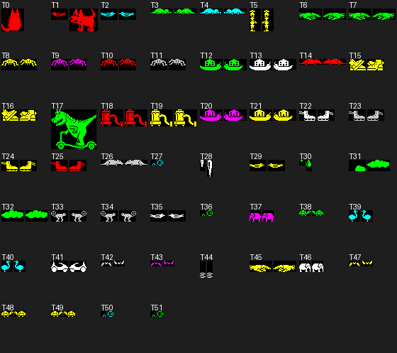
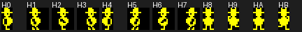
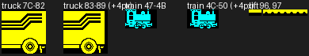
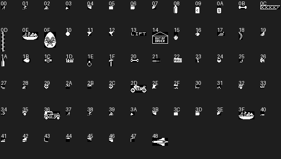
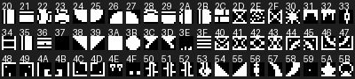

# Monsters, the sprite engine, graphics and frame timing

Scope: the nasties, the sprite drawing engine, every graphics table, the
IM 2 interrupt and the game's frame rate, plus a byte map of the graphics
and the monster workspace. Addresses are the running game's. Harry's
movement, objects and the front end are covered in their own files; where
this file touches them it says so and stops.

How things were verified (scripts in `build/research/monsters/`, run with
`.venv/bin/python`, all from `build/research/monsters/zx_start.z80`, a copy
of `shots/zx_start.z80`):

| Tag | Check | Script |
|---|---|---|
| **V-model** | After every interrupt for 150 frames in rooms 1, 4, 16, 59, 66, 94, 116: screen pixels = tile map rendered (tile font or ROM font) OR every live sprite's image OR every object in the room. All differences are pixels *missing* from the screen (objects a sprite erased, the truck, an undrawn special monster); paper/bright/flash always equal the `&5D00` map, only ink differs | `model.py`, `model2.py`, `model3.py` |
| **V-collide** | At 5,216 calls of `&937D` in 14 rooms with random input, a Python transcription of the pixel test predicted whether the game reached `&940A`: 5,216 right, 0 wrong. Of 86 hits, the box test's outcome (object / death / bounce / harmless / nothing) predicted 86 right | `collide.py` |
| **V-timing** | T-state of every IM 2 entry and every pass through `&77B9`, 300 frames in 7 rooms | `timing.py`, `load.py` |
| **V-egg** | `&9A80` called with eggs 1-7; enabled monster entries counted | `difficulty.py` |
| **V-watch** | Monster, train and lift records logged while watching rooms 1, 2, 4, 26, 34, 74, 94 (and screenshots) | `watch.py`, `ticks.py`, `lift.py`, `dogevent.py` |
| **V-list** | The draw list logged at each interrupt | `drawlist.py` |
| **V-rng** | Python RNG against 50 real calls of `&918A`: identical | `rng.py` |
| **V-gfx** | Every pointer table rendered to PNG (`sprites_*.png`, `types.png`, `tiles.png` there; summaries in `docs/research/img/`) and the region walked byte by byte | `render.py`, `budget.py`, `docsheets.py` |

Anything else is from reading the code and is marked *(read, not run)*.
An execution map of the tours used is `build/exec_monsters.map` (4,026
addresses: the original `exec.map` plus a teleport through all 120 rooms
twice with random input, `mapall.py`, `mapall2.py`).

## 1. Frame timing and the interrupt

### The IM 2 set-up

`&7703` (start-up, once) fills `&FE00-&FF00` (257 bytes) with `&FD`, puts
`JP &7ED9` at `&FDFD` and sets `I = &FE`. Whatever the data bus holds, the
vector is `&FDFD`. On the tape `&FDF8-&FEFF` are zeros (the code block ends
at `&FEFF`), so none of this needs to be in the port's image. The stack is
`&FFF0` (the main loop reloads `SP` before every `HALT`).

### The main loop is three frames, always

`&77B9` ends each of its three parts with `LD SP,&FFF0 : EI : NOP : HALT :
DI`. Interrupts are enabled only there, so each `HALT` takes exactly one
interrupt, and the handler never saves registers. **V-timing**: in every
room tried, one interrupt per frame and every pass exactly 3 frames (16.7
passes a second). The only longer passes are the ones that change room:
the room set-up `&7913` takes 4.8-7.2 frames with interrupts off (measured
in 10 rooms), and those frames are simply lost. Death, egg delivery and
the truck animations run their own `HALT` loops.

| Part | Starts after | Work (this file's scope in **bold**) |
|---|---|---|
| 0 | `&77B9` (loop top) | keys `&78C1`, Kempston merge `&9CE7`, Harry `&80B6`; draw list = [Harry] (`&77C2`); room change `&7913`; Harry's sound `&92F4` |
| — | `HALT` 1 | **IM 2: erase/draw Harry, redraw the current object** |
| 1 | `&7870` | Kempston `&9CC2`, sound, **train and truck `&8EE8`, lift `&90F0`, next object `&7F01`, monster tick A `&8C0A`** |
| — | `HALT` 2 | **IM 2: erase/draw the monsters that moved in tick A, redraw the object** |
| 2 | `&789B` | Kempston, **collisions `&936B`**, **monster tick B `&8C0A`**, **next object `&7F01`** |
| — | `HALT` 3 | **IM 2: erase/draw the monsters that moved in tick B, redraw the object** |
| 3 | `&78B4` | Kempston, **collisions `&936B`**, `JP &77B9` |

`&92E7` (the train's noise, see 6.2) is called eight times a pass by the
main loop, and once more by `&8EE8` when it turns the noise on.

So Harry moves and is redrawn once a pass; monsters get two ticks a pass,
in parts 1 and 2, and are redrawn at the interrupt that follows;
collisions are tested twice a pass, after each monster redraw.
**V-list** confirms the lists: `[A451]`, then e.g. `[A490]`, `[A4AA]`.

Frame load (**V-timing**, T-states from the frame's start to the next
`HALT`, of 69,888): part 0+3 averages 21-32k, worst 54k (room 16); part 1
17-26k; part 2 13-28k, worst 51k (room 4). The interrupt handler alone
averages 7-15k and reached 39k. Nothing came near a missed frame.

### The interrupt handler, `&7ED9` (40 bytes)

```
im2:                              ; DI on entry
  hl = &A41C                      ; the draw list
  loop:
    lo = (hl); hi = (hl+1)
    if hi == 0: break             ; terminator is any pointer with high byte 0
    IY = hi:lo; hl += 2
    erase(IY)                     ; &7FC9: old position
    draw(IY)                      ; &8063: new position
  IY = &A402                      ; the object record (7.1)
  if (&A405) != 0: draw(IY)       ; OR it on again, every frame
  EI; RET
```

Each sprite is erased then drawn before the next is touched, so a later
sprite's erase can cut into an earlier one's fresh pixels.

## 2. The sprite engine

### 2.1 Sprite format

Every sprite (Harry, monsters, machines, objects) is

```
byte 0     height in character rows (h)
byte 1     width in bytes (w)
2..        8*h rows of w bytes, row-major, top row first, bit 7 = leftmost pixel
```

There is no mask and no colour in the data. Size = 2 + 8hw. Three word
tables point at the headers: `&91B7` (152 entries: monsters, truck,
train, lifts), `&89FF` (12: Harry), `&8A98` (73: objects). `&8BDE` (31
bytes) loads one: `ptr = (HL + 2A)`; `IY+6 = h`, `IY+7 = w`, `IY+0/1 =
ptr + 2`.

**No shifting at draw time.** Horizontal positions are kept in quarter
characters (2 pixels): a column plus a sub-position 0-3. The frame for
sub-position *s* is a separate image already drawn *2s* pixels to the
right, one byte wider when it has to be, and each is a different pose:
the four frames of a walk cycle *are* the four pixel offsets. Measured
(**V-gfx**): bird frames 0-3 have their leftmost pixel at 0, 1, 4, 5;
crocodile 0, 2, 4, 6; the car is a pure 2-pixel shift (0, 2, 4, 6) of one
image; Harry 0, 2, 4, 6 (widths 1, 2, 2, 2). Fast monsters move 4 pixels a
step and have two frames a direction (offsets 0 and 4). Vertical positions
are exact pixel rows.

### 2.2 Sprite records (26 bytes, addressed by IY)

Harry (`&A451`), the monsters (`&A490 + 26n`), the current object
(`&A402`), the truck/train painter (`&A512`), the lift (`&A52C`) and a
falling dropped object (`&A546`) share the layout of the drawing fields.
The monster meaning of the others is given here; Harry's are in his file.

| Off | Field |
|---|---|
| +0/1 | image pointer (after the 2-byte header) |
| +2/3 | attribute address of the top-left cell. The low byte doubles as the screen address's low byte (column + 32 x row-in-third) |
| +4/5 | screen address of the top pixel row, left byte |
| +6 | height (rows) of the current frame |
| +7 | width (bytes) of the current frame |
| +8 | monster: tick counter |
| +9 | ink (0-7) |
| +A | sub-position: horizontal 0-3 (2 px each); vertical movers `(pixel row AND 7) / 2`; specials the forming frame |
| +B | dx in quarter characters a step (±1, ±2 fast) |
| +C | dy in pixel rows a step, **positive = up** (±2) |
| +D | base frame (index into `&91B7`) |
| +E/F | old attribute address |
| +10 | old height |
| +11 | old width |
| +12 | type flags |
| +13 | type speed byte (bits 5-6 = special state at run time) |
| +14 | start row |
| +15 | start column |
| +16/17 | old image pointer |
| +18/19 | old screen address |

`&884D` (49 bytes) copies the current fields to the old ones (+0/1 →
+16/17, +2/3 → +E/F, +4/5 → +18/19, +6 → +10, +7 → +11). Every mover calls
it just before changing position, so "old" is always what the interrupt
last drew.

### 2.3 Drawing: `&8063` (83 bytes)

```
draw(IY):
  a = attr; rows = h; if (scr_hi AND 7) != 0: rows += 1    ; spans one more row
  repeat rows: for x in 0..w-1: (a+x) = ((a+x) AND &F8) OR ink
               a += 32
  s = scr; d = img
  repeat 8*h: for x in 0..w-1: (s+x) |= (d); d += 1
              s = pixel_down(s)                            ; &7FB6
```

OR only; colour is the ink alone, so paper, bright and flash always stay
the room's. No clipping in either direction (monsters are kept inside by
their wall tests). **V-model**.

### 2.4 Erasing: `&7FC9` (154 bytes, inner loop entry `&8017`)

The background is never saved. It is rebuilt from the room drawer's maps:

```
erase(IY):                                   ; uses the OLD fields
  a = old_attr; rows = old_h; w = old_w
  if (old_scr_hi AND 7) != 0: rows += 1
  loop: copy w bytes from a + &0500 to a      ; &5D00 attribute map
        a += 32
        if a >= &5B00: break                  ; never below row 23
        rows -= 1; until rows == 0
  for col in 0..old_w-1:                      ; column by column
    p = old_scr + col; d = old_img + col
    repeat 8*old_h:
      if first row or (p_hi AND 7) == 0:      ; entering a character row
        cell = &6000 + 256*((p_hi >> 3) AND 3) + p_lo     ; tile map
        code = (cell)
        font = code bit 7 ? &3C00 (ROM font: text) : &73B8 (tile font)
        t = font + 8*(code AND &7F) + (p_hi AND 7)
      (p) = ((p) AND NOT (d)) OR (t); t += 1
      p = pixel_down(p); d += old_w
```

Only the bits of the old image are cleared; the tile is then ORed back.
Consequences the port must keep:

- Objects and the truck are not in the tile map, so a sprite passing over
  them removes their pixels; they are repaired by redrawing (the object
  round robin, 7.1; the truck refresh, 6.1). Harry is redrawn every pass,
  a monster only when it next moves.
- Where two sprites overlap, erasing one punches its shape out of the
  other until that one is redrawn.
- Text cells (tile code bit 7) restore from the ROM font.

Helpers: `&7FB6` pixel row down, `&7FA3` pixel row up (19 bytes each,
the usual Spectrum screen-address step); `&89BD` HL += 32, `&89C6` HL −= 32
(9 bytes each); `&8841` (12 bytes): `HL = (IY+2/3) + A + &0B00`, the
cell-type map (`&6300`) cell under an attribute address, `A = (HL)`.
`&7E34` (in the front end's file) turns C = row, B = column into the screen
address (HL) and attribute address (DE).

### 2.5 The other painter, `&7F4F` (53 bytes)

Used only for the truck and train strips (via `&8FC1`): paints ink into
`h` attribute cells down from `IY+2`, then *copies* (not ORs) one byte per
pixel row, `8h` rows, from the image to the screen. Width is ignored (all
its sprites are 1 byte wide). Called directly from the main loop, not from
the interrupt.

## 3. Monster definitions

### 3.1 The monster table, `&6B00-&6EFF` (1,024 bytes)

Four 256-byte columns, one entry per index *e* (0-255):

| Address | Meaning |
|---|---|
| `&6B00 + e` | room (1-120); **bit 7 set = disabled** |
| `&6C00 + e` | start character row (0-23) |
| `&6D00 + e` | start character column (0-31) |
| `&6E00 + e` | type (0-51) |

There is no per-room list: the room set-up scans all 256 entries. 108
rooms have at least one entry; no room has more than 4 (the workspace has
5 records).

### 3.2 Difficulty: more monsters per egg

`&9A80` (game and egg start, also used by the objects) at `&9AD2`:

```
n = min(egg, 5)                ; egg = (&A3F9), 1 for the first egg
k = (&83 + 25*n) AND &FF        ; 156, 181, 206, 231, 0
clear bit 7 of entries 0 .. k-1 ; (k = 0 means all 256)
set   bit 7 of entries k .. 255, then of entry 0 (the loop wraps)
```

So egg *n* has entries 1 .. min(130 + 25n, 255) and entry 0 is always off
at the start (it is the sitting dog, turned on by the dog event, 4.6).
**V-egg**: egg 1 = 155 entries (1-155), 2 = 180, 3 = 205, 4 = 230, 5 and
later = 255. Monsters per room, rooms with 0/1/2/3/4: egg 1 20/57/34/6/3;
egg 2 19/44/40/12/5; egg 3 17/37/35/26/5; egg 4 13/29/40/31/7; egg 5+
12/20/40/37/11. The extra entries are new monsters in new places, not
faster ones; nothing else about the monsters depends on the egg. (The
egg also picks which toy's parts are lying about, `&9B08`: objects' file.)

### 3.3 Monster types, `&6F00-&6FCF` (52 x 4 bytes)

| Byte | Meaning |
|---|---|
| 0 | ink |
| 1 | base frame: index into `&91B7` |
| 2 | flags (below) |
| 3 | speed: bits 0-4 = delay *d* (moves every *d*+1 ticks); bit 7 = special (4.5) |

Flag bits (byte 2):

| Bit | Name used here | Effect |
|---|---|---|
| 7 | FAST | step 2 instead of 1 (4 px horizontally); frame offset halved (2 frames a direction) |
| 6 | VERT | moves vertically (dy = 2 x step, dx = 0) |
| 5 | FREE | horizontal: needs no floor ahead (flyers); vertical: needs no rope/ladder |
| 4 | RESPAWN | when blocked: back to the start position (with room-specific events) instead of turning |
| 3 | NEG | starts moving left / down; for specials, see 4.5 |
| 2 | BOUNCE | touching it knocks Harry back |
| 1 | KILL | touching it kills Harry |
| 0 | STATIC | never moves (still redrawn each time its counter expires) |

Speeds: a tick comes every 1.5 frames on average (twice a pass), so a
monster with delay *d* steps every 1.5(*d*+1) frames: px/s = px per step x
33.3 / (*d*+1). **V-watch**: the room 1 bird (d = 3, 2 px) stepped every
4 ticks = 6 frames; the room 2 dog (d = 4) covered 90 px in 7 s
(predicted 13.3 px/s).

Names are from the pictures (`docs/research/img/monster-types.png`):



| T | Name | Ink | Base | Flags | Speed byte | Moves every | px/move | px/s | Rooms (entries) |
|---|---|---|---|---|---|---|---|---|---|
| 0 | dog sitting | 2 red | `0C` | `01` STATIC | `07` | 8 ticks | 0 | 0.0 | 2 |
| 1 | dog running | 2 red | `04` | `1A` RESPAWN NEG KILL | `04` | 5 ticks | 2 | 13.3 | 2 |
| 2 | bird | 5 cyan | `00` | `22` FREE KILL | `03` | 4 ticks | 2 | 16.7 | 1,3,4,5,6,7,50,100,113 |
| 3 | hedgehog | 4 green | `0D` | `02` KILL | `02` | 3 ticks | 2 | 22.2 | 8,11,11,65,68,98 |
| 4 | hedgehog | 5 cyan | `0D` | `0A` NEG KILL | `02` | 3 ticks | 2 | 22.2 | 7,11,11,17,19,57,61,89 |
| 5 | toy soldier | 6 yellow | `15` | `8A` FAST NEG KILL | `07` | 8 ticks | 4 | 16.7 | 22,44,111 |
| 6 | crocodile | 4 green | `29` | `0C` NEG BOUNCE | `04` | 5 ticks | 2 | 13.3 | 30,39,47,47 |
| 7 | crocodile | 4 green | `29` | `04` BOUNCE | `04` | 5 ticks | 2 | 13.3 | 18,27 |
| 8 | spider | 6 yellow | `35` | `42` VERT KILL | `04` | 5 ticks | 2 | 13.3 | 4,9,14,33,85,88 |
| 9 | spider | 3 magenta | `35` | `4A` VERT NEG KILL | `03` | 4 ticks | 2 | 16.7 | 4,27,101 |
| 10 | spider | 2 red | `35` | `42` VERT KILL | `02` | 3 ticks | 2 | 22.2 | unused |
| 11 | spider | 0 black | `35` | `4A` VERT NEG KILL | `02` | 3 ticks | 2 | 22.2 | 20,31,53,101 |
| 12 | snail | 4 green | `25` | `82` FAST KILL | `05` | 6 ticks | 4 | 22.2 | 32,89 |
| 13 | snail | 7 white | `25` | `8A` FAST NEG KILL | `05` | 6 ticks | 4 | 22.2 | 78 |
| 14 | rat | 2 red | `3B` | `8A` FAST NEG KILL | `03` | 4 ticks | 4 | 33.3 | 15,58,62,71,72,73,74,76,79,99 |
| 15 | trainer | 6 yellow | `1D` | `8C` FAST NEG BOUNCE | `05` | 6 ticks | 4 | 22.2 | 14,83,86,119 |
| 16 | trainer | 6 yellow | `1D` | `84` FAST BOUNCE | `05` | 6 ticks | 4 | 22.2 | 6,85 |
| 17 | dinosaur on scooter | 4 green | `37` | `9A` FAST RESPAWN NEG KILL | `04` | 5 ticks | 4 | 26.7 | 120 |
| 18 | vacuum cleaner | 2 red | `19` | `8A` FAST NEG KILL | `04` | 5 ticks | 4 | 26.7 | 97 |
| 19 | vacuum cleaner | 6 yellow | `19` | `8A` FAST NEG KILL | `04` | 5 ticks | 4 | 26.7 | 9,92 |
| 20 | snail | 3 magenta | `25` | `82` FAST KILL | `03` | 4 ticks | 4 | 33.3 | unused |
| 21 | snail | 6 yellow | `25` | `8A` FAST NEG KILL | `05` | 6 ticks | 4 | 22.2 | unused |
| 22 | skate | 7 white | `21` | `82` FAST KILL | `03` | 4 ticks | 4 | 33.3 | 25,25,25,35 |
| 23 | skate | 0 black | `21` | `82` FAST KILL | `03` | 4 ticks | 4 | 33.3 | 35 |
| 24 | skate | 6 yellow | `21` | `8A` FAST NEG KILL | `02` | 3 ticks | 4 | 44.4 | 43,44,45,46 |
| 25 | skate | 2 red | `21` | `8A` FAST NEG KILL | `04` | 5 ticks | 4 | 26.7 | 23 |
| 26 | rat | 0 black | `3B` | `8A` FAST NEG KILL | `03` | 4 ticks | 4 | 33.3 | 10,118 |
| 27 | bubble | 5 cyan | `3F` | `72` VERT FREE RESPAWN KILL | `81` special | 2 ticks | 2 | 33.3 | 16,55,64,81,88,89,93,101,113 |
| 28 | icicle | 7 white | `31` | `7A` VERT FREE RESPAWN NEG KILL | `80` special | 1 tick | 2 | 66.7 | 23,24,26,33,33,34,34,36,43,44,45 |
| 29 | bird | 6 yellow | `00` | `22` FREE KILL | `02` | 3 ticks | 2 | 22.2 | 5,13,20,28,56,66,66,69,84,87,87,89,100,112,112 |
| 30 | drip | 4 green | `43` | `7A` VERT FREE RESPAWN NEG KILL | `80` special | 1 tick | 2 | 66.7 | 37,47,62,64,65,94,94,94,94,114,114,114,116,116,116,116,117,117,117,117 |
| 31 | cloud | 4 green | `51` | `72` VERT FREE RESPAWN KILL | `81` special | 2 ticks | 2 | 33.3 | 70 |
| 32 | steam | 4 green | `54` | `72` VERT FREE RESPAWN KILL | `01` | 2 ticks | 2 | 33.3 | 30,40,50,60 |
| 33 | monkey | 0 black | `58` | `0A` NEG KILL | `01` | 2 ticks | 2 | 33.3 | 12,41,42 |
| 34 | monkey | 0 black | `58` | `0A` NEG KILL | `03` | 4 ticks | 2 | 16.7 | 31 |
| 35 | bird | 7 white | `00` | `22` FREE KILL | `02` | 3 ticks | 2 | 22.2 | 91 |
| 36 | bubble | 4 green | `3F` | `74` VERT FREE RESPAWN BOUNCE | `81` special | 2 ticks | 2 | 33.3 | 5,24,85,91,91,93,99,103,103 |
| 37 | elephant | 3 magenta | `60` | `62` VERT FREE KILL | `01` | 2 ticks | 2 | 33.3 | 16,57,58,88,102,108 |
| 38 | tortoise | 4 green | `8A` | `82` FAST KILL | `04` | 5 ticks | 4 | 26.7 | 13,40,63,69,86,98,102 |
| 39 | ostrich | 5 cyan | `8E` | `02` KILL | `02` | 3 ticks | 2 | 22.2 | 82,83,93 |
| 40 | ostrich | 5 cyan | `8E` | `0A` NEG KILL | `04` | 5 ticks | 2 | 13.3 | 82,92 |
| 41 | car | 7 white | `68` | `0C` NEG BOUNCE | `05` | 6 ticks | 2 | 11.1 | 34,49,56,56,69 |
| 42 | bat | 0 black | `78` | `62` VERT FREE KILL | `02` | 3 ticks | 2 | 22.2 | 18,31,32,67,68,101,111,113 |
| 43 | bat | 3 magenta | `78` | `62` VERT FREE KILL | `02` | 3 ticks | 2 | 22.2 | 24,29,47,49,50,55,55,57,87,92,98 |
| 44 | spring | 7 white | `70` | `0C` NEG BOUNCE | `03` | 4 ticks | 2 | 16.7 | 9,19,21,22,28,37,39,41,52,53,54,59,61,67,71,73,75,90,90,102 |
| 45 | crocodile | 6 yellow | `29` | `0A` NEG KILL | `02` | 3 ticks | 2 | 22.2 | 16,59,59,66 |
| 46 | elephant | 7 white | `64` | `62` VERT FREE KILL | `00` | 1 tick | 2 | 66.7 | 15,18,23,68,86,108 |
| 47 | bat | 6 yellow | `78` | `62` VERT FREE KILL | `01` | 2 ticks | 2 | 33.3 | unused |
| 48 | tortoise | 6 yellow | `8A` | `82` FAST KILL | `06` | 7 ticks | 4 | 19.0 | 60,66,70,77,77,97,97,99,103 |
| 49 | tortoise | 6 yellow | `8A` | `82` FAST KILL | `01` | 2 ticks | 4 | 66.7 | 88 |
| 50 | bubble | 5 cyan | `3F` | `62` VERT FREE KILL | `80` special | 1 tick | 2 | 66.7 | 42,42,52,64,105 |
| 51 | bubble | 4 green | `3F` | `64` VERT FREE BOUNCE | `80` special | 1 tick | 2 | 66.7 | 3,3,29,29,29,40,42,53,54,62,63,72,84 |

Unused types: 10, 20, 21, 47 (no table entry). "px/s" is the average
speed while moving; specials only move once they fall or rise.

## 4. Monsters at run time

### 4.1 Room entry: `&8B2A` (51 bytes) and `&8B5D` (129 bytes)

Called from `&7913` after the room is drawn.

```
setup_monsters:                       ; &8B2A
  draw list (&A41C) = empty
  IY = &A490; count = 0
  for L = 1, 2, ..., 255, 0:          ; INC L before each compare
    if (&6B00+L) == room:             ; bit 7 set never matches
      setup_monster(IY, L, count); count += 1; IY += 26
  (&A48F) = count
  if room == 1 or room == 111: draw the truck (&9011, 6.1)

setup_monster(IY, L, count):          ; &8B5D
  IY+14 = row = (&6C00+L); IY+15 = col = (&6D00+L)
  IY+2/3, IY+4/5 = addresses of (row, col)          ; &7E34
  t = (&6E00+L): IY+9 = ink, IY+D = base, IY+12 = flags, IY+13 = speed
  IY+8 = count + 1                    ; 1, 2, 3, 4: staggers the first moves
  IY+A = 0
  step = flags.FAST ? 2 : 1;  if flags.NEG: step = -step
  if flags.VERT: dx = 0; dy = 2*step  else: dx = step; dy = 0
  choose_frame(IY)                    ; &8E70
```

Nothing is drawn here. A monster first appears when it first moves; a
special in its idle state stays invisible (4.5). The old fields are left
from the previous room until the first move copies them.

### 4.2 The tick: `&8C0A` (34 bytes) and `&8C2C` (580 bytes)

```
monsters_tick:                        ; &8C0A, twice a pass
  IX = &A41C; IY = &A490
  repeat (&A48F) times: tick(IY); IY += 26
  (IX) = &0000                        ; terminate the draw list

tick(IY):                             ; &8C2C
  random()                            ; &918A: every monster, every tick
  IY+8 -= 1
  if IY+8 >= 0: return                ; not moved, not redrawn
  IY+8 = speed AND &1F
  if speed bit 7: goto special        ; 4.5
  if flags.STATIC: dx = dy = 0; goto move
  if flags.VERT: goto vertical        ; 4.4
  ; horizontal (4.3)
  ...
move:                                 ; &8E59
  save_old(IY)                        ; &884D
move_nosave:                          ; &8E5C
  step(IY)                            ; &8E94
  choose_frame(IY)                    ; &8E70
  (IX) = IY; IX += 2                  ; append to the draw list
```

### 4.3 Horizontal movers (in `&8C2C`)

Walls and floors are read from the cell-type map (`&6300`, filled by the
room drawer and by objects: an object ORs/XORs `&40` into the cells it
covers, `&41` the girder, `&42` the ladder, `&9A10`). The masks: a cell
**blocks** if `type AND &FD` is non-zero (anything but bit 1, the
rope/ladder bit; objects and hazards block too); a cell is **floor** if
`type AND &21` is non-zero.

```
  if IY+A != 0: goto move             ; only test on a character boundary
  if dx >= 0:                         ; moving right
    if col + w >= 32: goto blocked
    for r in 0..h-1: if type(row+r, col+w) AND &FD: goto blocked
    if not flags.FREE and type(row+h, col+w) AND &21 == 0: goto blocked
  else:                               ; moving left
    if col == 0: goto blocked
    for r in 0..h-1: if type(row+r, col-1) AND &FD: goto blocked
    if not flags.FREE and type(row+h, col-1) AND &21 == 0: goto blocked
  goto move
blocked:
  if flags.RESPAWN: goto respawn      ; 4.6
  dx = -dx; goto move                 ; turns and steps the same tick
```

*w* and *h* are the current frame's (at sub-position 0, the narrowest).
So walkers turn at walls, screen edges and platform ends (the cell
diagonally ahead and below must be floor); flyers (FREE) turn only at
walls and edges.

### 4.4 Vertical movers (`&8CC6`, check at `&8CD3`)

```
vertical:
  IY+A = (scr_hi AND 7) >> 1          ; animation from the pixel row
  if IY+A != 0: goto move
vcheck:                               ; &8CD3, also used by specials
  if dy >= 0:                         ; up
    if top row <= 2: goto vblocked    ; attr < &5860 (rows 0-1 are the status bar)
    cells = row-1, columns col..col+w-1
  else:                               ; down
    if row + h >= 24: goto vblocked
    cells = row+h, columns col..col+w-1
  ropes = 0
  for each cell: if bit 1: ropes += 1
                 if type AND &FD: goto vblocked
  if not flags.FREE and ropes == 0: goto vblocked
  goto move
vblocked:                             ; &8D3C
  if flags.RESPAWN: goto respawn
  dy = -dy; goto move
```

Spiders (no FREE) need a rope cell in the row they move into; bats,
elephants, steam and the specials don't. Starting on a character row and
moving 2 pixels a step, they test every 4th step.

### 4.5 Specials (speed bit 7): icicles, drips, bubbles, clouds (`&8DD5`)

State is speed bits 6, 5. The random test is a *second* call of `&918A`
in the same tick; A is the new top byte of the state.

```
special:
  state 00 (idle, invisible):
    if not flags.NEG and random() >= 10: return       ; 10/256 a tick
    IY+A = 0; dy = 0; state = 01; IY+8 = 10; goto move
  state 01 (forming):                                 ; frames base+0..3
    if IY+A == 3: state = 10; goto move
    IY+8 = 10; IY+A += 1; goto move                   ; each frame held 11 ticks
  state 10 (formed, waiting):
    if flags.NEG and random() >= 10: return
    dy = flags.NEG ? -2 : +2; state = 11; goto move
  state 11 (moving):
    if (scr_hi AND 7) == 0: goto vcheck              ; 4.4
    goto move
```

NEG thus means "forms at once, drops after a random wait, downwards"
(icicles T28, drips T30); without it, "waits a random time invisible,
forms, rises at once" (bubbles T27, T36, cloud T31). Respawning specials
vanish when blocked and start again; T50/T51 (no RESPAWN) form once and
then bounce up and down for ever. The frame stays base+3 while moving.
**V-watch** (room 94, four T30 drips): speed bytes cycle `&A0` → `&C0` →
`&E0` (falling, dy = −2) → `&80` (respawned).

### 4.6 Respawn and the two room events (`&8D4D`)

```
respawn:
  save_old(IY)
  if room == 120:                     ; the dinosaur on its scooter
    flags = STATIC; IY+D += 2; dx = 0; IY+A = 0
    goto move_nosave                  ; frame &39, stopped
  if room == 2:                       ; the dog
    IY+D = &0C (sitting); dx = 0; IY+A = 0; flags = STATIC
    (&6B00) bit 7 = 0; (&6B01) bit 7 = 1   ; sitting dog (entry 0) replaces
                                            ; running dog (entry 1) for good
    with IY = &A402: place object &24 (the bone) to toggle its cell types
      off (&9A10), (&6624) = 0 (the bone is gone), save_old, erase it, (&A405) = 0
    goto move_nosave
  if speed bit 7:                     ; specials vanish
    erase(IY) now                     ; &7FC9, from the main loop
    speed bits 5, 6 = 0               ; idle
  IY+2..5 = addresses of (IY+14, IY+15)   ; back to the start
  if speed bit 7: return              ; not drawn
  goto move_nosave                    ; others step from the start at once
```

The events are keyed on the *room*, not the type. In room 2 the running
dog (T1: base 4, NEG, so its left-facing frames are 4 + 4 + s = `&08-&0B`)
runs left until blocked, by the edge, a gap or an object such as the
dropped bone, and then sits (frame `&0C`) for the rest of the game.
**V-watch**: with Harry immune the dog reached column 0 after 9.5 s and
its record became base `&0C`, flags `&01`, and entries 0/1 swapped
(`&82 &02` → `&02 &82`). The bone goes even when it is elsewhere: in that
run it was still in room 11, its room byte became 0, and room 2's
cell-type map gained a stray `&40` at row 5, column 29 (the bone's cell in
room 11) for as long as Harry stayed: an original bug to keep or to log
as a decision.

### 4.7 Choosing the frame and stepping

`&8E70` (36 bytes):

```
b = (dx < 0 ? 4 : 0) + IY+A
if flags bit 7: b >>= 1
set_frame(&91B7, IY+D + b)            ; &8BDE: IY+0/1, +6, +7
```

Right-moving frames are base+0..3, left base+4..7 (fast: +0,1 and +2,3);
vertical movers base + (pixel row AND 7)/2.

`&8E94` (84 bytes):

```
a = IY+A + dx; IY+A = a AND 3
if a < 0: col -= 1                     ; DEC IY+2
elif a >= 4: col += 1
scr = (IY+5):(IY+2)
if dy > 0: repeat dy: scr = pixel_up(scr)
if dy < 0: repeat -dy: scr = pixel_down(scr)
IY+5 = scr_hi; IY+2 = IY+4 = scr_lo
IY+3 = &58 OR ((scr_hi >> 3) AND 3)    ; attribute row of the top pixel row
```

## 5. Collision with Harry

`&936B` (twice a pass, parts 2 and 3) calls `&937D` with IY = Harry.

### 5.1 The pixel test, `&937D`/`&93B5` (141 bytes)

Harry's window is 8 pixels wide: his sprite is 1 byte wide at
sub-position 0 and 2 bytes at 1-3 (frames 1-3, 5-7).

```
collide:
  c = &FF
  if w != 1: repeat IY+A times: c >>= 2    ; (IY+A = 0 would mean 256 shifts)
  mask = NOT c                         ; first column: ignore the left 2*sub pixels
  for col in 0..w-1:
    for each of the 8h pixel rows (tile pointer as in erase):
      if (screen) AND NOT ((img) OR tile pixel OR mask) != 0: goto hit
    mask = NOT mask                    ; second column: ignore all but the left 2*sub
  return
```

"Anything on the screen in Harry's window that is neither Harry nor the
room": a monster, an object, a train or truck pixel. **V-collide**.

### 5.2 Who was hit, `&940A` (219 bytes)

Boxes are character cells, `&968C` (37 bytes): left = column, right =
column + w − 1, top = row, bottom = row + h − 1, from the attribute
address and the current frame (an unaligned sprite's extra row is not
counted). `&9674` (24 bytes) is the inclusive overlap test.

```
hit:
  hb = box(Harry)
  if (&A405) != 0 and overlap(hb, box(&A402)): goto touch_object   ; &9515, objects' file
  for each monster in record order:
    if overlap(hb, box(monster)): goto contact                     ; first one decides
  if 71 <= room <= 80 and Harry's top row <= 7: die                ; (&A454) == &58: the train
  if room == 111 and Harry's column < 7 and carrying (&A560) == &28: egg delivered (&946E)
  return
contact:                              ; &94E5 (48 bytes)
  if flags.KILL: die                  ; &8A29
  if flags.BOUNCE:
    (&A487) = 7; (&A485) = 2          ; Harry's knocked-back state: Harry's file
    repeat a = random() AND 3 until a != 3
    Harry+8 = a - 1                   ; -1, 0, +1
    Harry+D = random() AND 4
  return                              ; neither: harmless
```

So an overlap with the object being redrawn hides any monster that same
test. **V-collide**: 86 of 86 outcomes predicted. The POK file's
"immunity" (`&8A29` = `RET`) works because every death goes there.

## 6. Machines (non-monster moving things)

### 6.1 The truck (rooms 1 and 111)

The truck is 7 strips of 7 x 1 characters, sprites `&7C-&82` (and `&83-&89`
drawn 4 pixels further right), yellow, painted by `&8FC1` / `&7F4F`
(overwriting) through the record `&A512`:

- `&9011` (23 bytes), room entry: strips `&7C-&82` at columns 0-6, row 16
  (room 1) or 17 (room 111).
- `&8FED` (36 bytes), every pass in those rooms: `&91B6` = (`&91B6` + 1)
  mod 7, and that one strip is redrawn: the repair for sprites erasing it.
- `&9028` (38 bytes), new game: 14 steps, 10 frames each (`&904E`), the
  truck growing in from the left edge (the last *n* strips of either set,
  4 pixels a step).
- `&9059` (47 bytes), egg delivered: the reverse, the strip behind
  restored from the maps (`&8FA5`).

### 6.2 The train (rooms 71-80), `&8EE8` (189 bytes)

```
machines:                             ; once a pass, part 1
  (&91B5) = 0                         ; noise off
  if (&A48C) bit 0:                   ; power on (set by the objects' code, &95FF)
    (&A48E) = ((&A48E) + 1) AND 63
    if (&A48E) == 0: (&A48D) += 1; if (&A48D) == 81: (&A48D) = 71
  if room == 1 or room == 111: truck_refresh; return
  t = (&A48D); p = (&A48E)
  if room == t:                       ; train here
    col = p >> 1; first = p odd ? &4C : &47; n = min(32 - col, 5)
    draw_here(col, first, n)
  elif p != 0 and t == next(room):    ; just left: restore column 31, rows 5-7
    restore(col 31, rows 5..7); return
  elif t == prev(room) and p >= &37:  ; front pokes in from the left
    n = (p - &35) >> 1
    first = ((p - &35) odd ? &51 : &4C) - n     ; the last n strips
    draw_here(0, first, n)
  else: return
draw_here(col, first, n):             ; &8F7F
  if col != 0: restore(col - 1, rows 5..7)       ; &8FA5: from the maps
  draw n strips first.. at row 5, column col, ink 5 (cyan)   ; &8FC1
  if power: (&91B5) = 1; click()      ; &92E7: speaker = random() AND &10
```

`next`/`prev` wrap 80 ↔ 71 (`prev(71)` = 80; `prev` of room 81 returns).
At start (`&9AFD`) the train is in room 74 at position 6, with the power
off, so it stands still. **V-watch** (power poked on): the position
advanced 1 a pass, 64 a room, then room 74 → 75. The front poking into
the next room takes its parity from p − &35, the opposite of the main
part's: `trainedge.py`, watching column 0 of room 75 while the train
was in 74, saw p = &37 → strip `&4B`, &38 → `&50`, &39 → `&4A`, ...
&3F → `&47`, then in room 75 itself p = 0 → `&47`, 1 → `&4C`. So at odd p
the next room shows aligned strips while the train's own room shows
shifted ones. Touching the train: any foreign pixel in Harry's
window while his top row is 0-7 in rooms 71-80 kills (5.2). `&92E7` also
clears the border to black while it clicks.

### 6.3 The lifts, `&9088` (88 bytes), `&90F0` (154 bytes)

Table `&90E0`, 4 x (room, row, column, type): room 26 (23, 7, 1), 55 (23,
23, 1), 34 (4, 15, 2), 104 (4, 17, 2). Record `&A52C`; sprite `&95` +
type: `&96` (1 x 2, type 1) or `&97` (1 x 7, type 2); ink 6. Type 2 is one
row lower until the power is on. Moved and drawn (erase + draw) once a
pass directly from the main loop. With the power off it is just redrawn.
With it on:

- type 1: dy = +2 (up); on reaching row 3 (character-aligned, attribute
  `&5880`) it jumps back to its start: a never-ending rising platform.
- type 2: dy = −2 while Harry is in state 8 (on it: Harry's file), stopping
  at row 23 or when any of the 7 cells below has a type bit other than 5;
  otherwise dy = +2 until its top pixel row is in row 4 (it stops 2
  pixels into row 4).

**V-watch** (`lift.py`, power poked on): the room 26 bar rose 2 pixels a
pass from y = 184 to y = 24 (row 3) and started again at the bottom, a
4.8-second loop; the room 34 platform sat at y = 32 (row 4) with Harry not
on it. The type 2 descent is *(read, not run)*.

### 6.4 Not sprites

The moon and the stars of the night-sky rooms are tiles in the room data
(`build/rooms/room_001.png` has them and no truck). The room 1 bird is an
ordinary monster (T2, which kills: it flies along row 8, turning at the
edges).

## 7. Objects: the drawing side

The objects' own logic is in the objects file. Here only how they get on
the screen.

### 7.1 The round robin, `&7F01` (78 bytes)

Objects are never in the tile map, and nothing erases them except
sprites. Twice a pass (parts 1 and 2) the next object in this room is
loaded into `&A402`; the interrupt ORs it onto the screen every frame
until the next call.

```
next_object:
  hl = (&A400)                        ; H = &66, L = last index
  repeat 128: L += 1 (within the page)
              if (&6600 + L) == room: goto found
  (&A400) = hl; (&A405) = 0; return   ; nothing to draw
found:
  (&A400) = hl
  IY = &A402; position from row (&6700+L), column (&6800+L)
  t = (&6900+L); rec = &6A00 + 3t
  IY+9 = rec[0] (ink); IY+D = rec[1]; IY+12 = rec[2]
  set_frame(&8A98, rec[1])
```

All 256 entries of the page are candidates, though only the first 41
(`&00-&28`) are put into the cell-type map (`&99F6`); what they all are
is in the objects file. **V-list**: the object record is
live in some frames and not others in room 116.

## 8. Graphics inventory

| Range | Bytes | What | Format |
|---|---|---|---|
| `&3D00-&3FFF` (ROM) | 768 | Spectrum ROM font, glyphs `&20-&7F` | 8 bytes a glyph. All text: status bar, score digits (`&A0E2`), room text (tile codes with bit 7 set; rooms use space and A-Y). The port must carry the glyphs it uses |
| `&6FD0-&74B7` | 1,256 | object sprites, 64 distinct (73 pointers at `&8A98`) | sprite format |
| `&74B8-&7697` | 480 | tile font, tiles `&20-&5B` (60) | 8 bytes a tile, at `&73B8 + 8c`. Rooms use 55; `&31`, `&3B-&3D`, `&56` appear in none; `&56` is the lives icon |
| `&89FF-&8A16` | 24 | Harry's frame pointers (12, 11 distinct) | words |
| `&8A98-&8B29` | 146 | object sprite pointers (73) | words |
| `&91B7-&92E6` | 304 | sprite pointers (152, 128 distinct) | words |
| `&DFA2-&E0C7` | 294 | Harry, 11 images | sprite format |
| `&E0C8-&FDF7` | 7,472 | monsters, truck, train, lifts (7,456) and 16 unreferenced bytes at `&EA8E` | sprite format |

Total graphics data: 9,502 bytes plus 474 bytes of pointers (and whatever
ROM glyphs the port needs). Pointer aliasing saves space: e.g. the 4
elephant frames `&60-&63` are one image, the vacuum cleaner's left frames
are its right ones.









The object sprites `&25-&48` are the four toys in nine pieces each:
`&25-&2D` motorbike (assembled `&2D`), `&2E-&36` car, `&37-&3F` boat,
`&40-&48` jet; `&9B08` points the nine toy-part object types at one set
per egg (egg 1 motorbike, 2 car, 3 boat, 4 jet, then again). **V-egg**.
`&00-&07` and `&0E` are the boat's parts again (aliases of `&37-&3F`),
only used before `&9B08` first runs.

### 8.1 `&DFA2-&FEFF` byte by byte

Sizes "h x w" are character rows x bytes.

| Range | Bytes | What | Sprite indices (h x w) |
|---|---|---|---|
| `&DFA2-&E0C7` | 294 | Harry | H0 (2x1), H1 (2x2), H2 (2x2), H3 (2x2), H4 (2x1), H5 (2x2), H6 (2x2), H7 (2x2), H8,HA (2x1), H9 (2x1), HB (2x1) |
| `&E0C8-&E38F` | 712 | dog running | &08 (4x5), &09 (4x5), &0A (4x6), &0B (4x6) |
| `&E390-&E411` | 130 | dog sitting | &0C (4x4) |
| `&E412-&E5C1` | 432 | bird | &00 (2x3), &01 (2x3), &02 (2x3), &03 (2x4), &04 (2x3), &05 (2x3), &06 (2x3), &07 (2x4) |
| `&E5C2-&E6F1` | 304 | hedgehog | &0D (1x4), &0E (1x4), &0F (1x5), &10 (1x5), &11 (1x4), &12 (1x4), &13 (1x5), &14 (1x5) |
| `&E6F2-&E7F9` | 264 | toy soldier | &15 (4x2), &16 (4x2), &17 (4x2), &18 (4x2) |
| `&E7FA-&E8BD` | 196 | vacuum cleaner | &19,&1B (3x4), &1A,&1C (3x4) |
| `&E8BE-&E9A5` | 232 | trainer | &1D (2x3), &1E (2x4), &1F (2x3), &20 (2x4) |
| `&E9A6-&EA8D` | 232 | skate | &21 (2x3), &22 (2x4), &23 (2x3), &24 (2x4) |
| `&EA8E-&EA9D` | 16 | unreferenced (`03 FF F0 00 00 00 3F F0 03 FF F7 F0 03 FF C7 F0`) | |
| `&EA9E-&EBA5` | 264 | snail | &25 (2x4), &26 (2x4), &28 (2x4), &27 (2x4) |
| `&EBA6-&EDF5` | 592 | crocodile | &29 (2x4), &2A (2x4), &2B (2x5), &2C (2x5), &2D (2x4), &2E (2x4), &2F (2x5), &30 (2x5) |
| `&EDF6-&EE4D` | 88 | icicle | &31 (2x1), &32 (2x1), &33 (3x1), &34 (3x1) |
| `&EE4E-&EEE3` | 150 | spider | &35,&37 (2x3), &36 (2x3), &38 (2x3) |
| `&EEE4-&F29F` | 956 | dinosaur on scooter | &39 (7x8), &3A (7x9) |
| `&F2A0-&F337` | 152 | rat | &3B (1x4), &3C (1x5), &3D (1x4), &3E (1x5) |
| `&F338-&F35F` | 40 | bubble | &3F (1x1), &40 (1x1), &41 (1x1), &42 (1x1) |
| `&F360-&F38F` | 48 | drip | &43 (1x1), &44 (1x1), &45 (1x1), &46 (2x1) |
| `&F390-&F493` | 260 | train strip | &47 (3x1), &48 (3x1), &49 (3x1), &4A (3x1), &4B (3x1), &4C (3x1), &4D (3x1), &4E (3x1), &4F (3x1), &50 (3x1) |
| `&F494-&F539` | 166 | cloud | &51 (2x3), &52 (2x3), &53 (2x4) |
| `&F53A-&F57B` | 66 | steam | &54,&55,&56,&57 (2x4) |
| `&F57C-&F6C7` | 332 | monkey | &58,&5A (2x3), &59 (2x3), &5B (2x4), &5C,&5E (2x3), &5D (2x3), &5F (2x4) |
| `&F6C8-&F70B` | 68 | elephant | &60,&61,&62,&63 (2x2), &64,&65,&66,&67 (2x2) |
| `&F70C-&F8FB` | 496 | car | &68 (2x3), &69 (2x4), &6A (2x4), &6B (2x4), &6C (2x3), &6D (2x4), &6E (2x4), &6F (2x4) |
| `&F8FC-&F99B` | 160 | spring | &70,&74 (3x1), &71,&75 (3x2), &72,&76 (2x2), &73,&77 (3x2) |
| `&F99C-&F9BF` | 36 | bat | &78,&79 (1x2), &7A,&7B (1x2) |
| `&F9C0-&FC03` | 580 | truck strip | &7C,&7D,&7E,&83,&84 (7x1), &7F (7x1), &80 (7x1), &81 (7x1), &82 (7x1), &85 (7x1), &86 (7x1), &87 (7x1), &88 (7x1), &89 (7x1) |
| `&FC04-&FC5B` | 88 | tortoise | &8A (1x2), &8B (1x3), &8C (1x2), &8D (1x3) |
| `&FC5C-&FDAB` | 336 | ostrich | &8E (2x2), &8F (2x2), &90 (2x3), &91 (2x3), &92 (2x2), &93 (2x2), &94 (2x3), &95 (2x3) |
| `&FDAC-&FDE5` | 58 | lift platform | &97 (1x7) |
| `&FDE6-&FDF7` | 18 | lift bar | &96 (1x2) |
| `&FDF8-&FDFC` | 5 | zeros | |
| `&FDFD-&FDFF` | 3 | `JP &7ED9`, written by `&7703` (zeros on the tape) | |
| `&FE00-&FF00` | 257 | IM 2 vector table, `&FD` x 257, written by `&7703` | |

Above that, `&FF01-&FFFF` is outside the tape image: the stack (`SP` =
`&FFF0`, shallow) and the ROM's default UDGs left by BASIC. `&FFFF` is read
once at start-up as a developer cheat byte (front end's file).

## 9. Memory budget for this scope

| Range | Bytes | Contents |
|---|---|---|
| `&6B00-&6EFF` | 1,024 | monster table |
| `&6F00-&6FCF` | 208 | monster types |
| `&6FD0-&74B7` | 1,256 | object sprites |
| `&74B8-&7697` | 480 | tile font |
| `&89FF-&8A16` | 24 | Harry frame pointers |
| `&8A98-&8B29` | 146 | object sprite pointers |
| `&90E0-&90EF` | 16 | lift table |
| `&91B1-&91B6` | 6 | RNG state (4), noise flag, truck strip counter |
| `&91B7-&92E6` | 304 | sprite pointers |
| `&DFA2-&FDF7` | 7,766 | Harry and monster/machine sprites |
| code | 2,667 | the routines below |

Workspace: `&A400` object scan pointer (2), `&A402-&A41B` object record,
`&A41C-&A42B` draw list (at most 4 monsters + terminator, or Harry + 0),
`&A48C` factory flags (bit 0 = power), `&A48D` train room, `&A48E` train
position, `&A48F` monster count, `&A490-&A511` five monster records (four
ever used), `&A512-&A52B` strip painter, `&A52C-&A545` lift (`&A534` = its
type, 0 = none), `&A546-&A55F` falling dropped object (`+8` = object, `&FF`
= none).

Routines (bytes): `&7ED9` 40, `&7F01` 78, `&7F4F` 53, `&7FA3` 19, `&7FB6`
19, `&7FC9` 154, `&8063` 83, `&8841` 12, `&884D` 49, `&89BD` 9, `&89C6` 9,
`&8B2A` 51, `&8B5D` 129, `&8BDE` 31, `&8BFD` 13, `&8C0A` 34, `&8C2C` 580,
`&8E70` 36, `&8E94` 84, `&8EE8` 189, `&8FA5` 28, `&8FC1` 44, `&8FED` 36,
`&9011` 23, `&9028` 38, `&904E` 11, `&9059` 47, `&9088` 88, `&90F0` 154,
`&918A` 39, `&936B` 18, `&937D` 141, `&940A` 219 (includes the egg-delivered
sequence), `&94E5` 48, `&9674` 24, `&968C` 37.

## 10. Random numbers, `&918A` (39 bytes)

```
V = big-endian 32 bits at &91B1..&91B4      ; "9090" on the tape
V = (V << 1) OR (bit 30 of V XOR bit 27 of V)
return A = V >> 24                          ; the new (&91B1)
```

**V-rng**. Callers: every monster tick (`&8C2C`), specials' waits
(`&8DEA`, `&8E0A`), the train noise (`&92E7`, nine times a pass while it
sounds), a bounce (`&94FF`, `&950C`, twice or more), and the objects'
`&9541`/`&954C`. The specials' timing therefore depends on how many
monsters share the room and on the call order; a faithful port keeps the
same calls in the same order.

## 11. Open questions

- The type 2 lift's descent under Harry (6.3) was read, not watched.
- Cell-type bit meanings beyond the masks used here (`&FD` blocks, `&21`
  floor, bit 1 rope) belong to the Harry and rooms write-ups.
- Harry's frame choice and his knocked-back state 7 are in Harry's file.
- For the port (not questions about the original, but things it forces):
  the collision test reads the *screen* (5.1) and the erase rebuilds from
  the tile map plus the font (2.4), so a 2-bits-a-pixel screen needs an
  equivalent "is anything here that isn't Harry or the room" test; text
  restores from the Spectrum ROM font, whose glyphs the port must carry;
  and the frame rate (3 frames a pass at 50 Hz) carries over to a 50 Hz
  BBC unchanged.

## Appendix A: monsters by room (`&6B00-&6EFF`)

Every table entry, grouped by room, as `entry type name (row,col)`; the
bracket says from which egg an entry is enabled when it isn't egg 1.

| Room | Entries: `entry type name (row,col)`, egg it first appears from if not 1 |
|---|---|
| 1 | 2 T2 bird (8,0) |
| 2 | 0 T0 dog sitting (19,15) [after dog event]; 1 T1 dog running (19,15) |
| 3 | 3 T2 bird (8,0); 59 T51 bubble (22,28); 156 T51 bubble (22,27) [egg 2] |
| 4 | 13 T8 spider (9,10); 14 T9 spider (13,18); 239 T2 bird (7,1) [egg 5] |
| 5 | 53 T2 bird (19,6); 54 T29 bird (19,16); 157 T36 bubble (21,14) [egg 2] |
| 6 | 26 T16 trainer (21,7); 40 T2 bird (4,15) |
| 7 | 41 T2 bird (19,8); 190 T4 hedgehog (11,25) [egg 3] |
| 8 | 55 T3 hedgehog (11,4) |
| 9 | 17 T8 spider (15,5); 141 T19 vacuum cleaner (20,27); 196 T44 spring (13,19) [egg 3] |
| 10 | 57 T26 rat (10,7) |
| 11 | 4 T3 hedgehog (7,4); 6 T3 hedgehog (17,7); 171 T4 hedgehog (22,25) [egg 2]; 172 T4 hedgehog (12,18) [egg 2] |
| 12 | 89 T33 monkey (21,27) |
| 13 | 134 T38 tortoise (8,15); 238 T29 bird (13,1) [egg 5] |
| 14 | 27 T15 trainer (21,17); 51 T8 spider (4,2) |
| 15 | 44 T14 rat (22,27); 246 T46 elephant (16,12) [egg 5] |
| 16 | 61 T27 bubble (21,25); 138 T45 crocodile (21,15); 142 T37 elephant (9,5) |
| 17 | 42 T4 hedgehog (22,22) |
| 18 | 43 T7 crocodile (21,18); 200 T46 elephant (14,15) [egg 3]; 208 T42 bat (14,22) [egg 4] |
| 19 | 56 T4 hedgehog (22,23); 192 T44 spring (12,20) [egg 3] |
| 20 | 15 T11 spider (19,25); 214 T29 bird (10,15) [egg 4] |
| 21 | 135 T44 spring (20,20) |
| 22 | 38 T5 toy soldier (19,1); 234 T44 spring (8,18) [egg 5] |
| 23 | 49 T25 skate (21,2); 62 T28 icicle (2,16); 197 T46 elephant (3,26) [egg 3] |
| 24 | 97 T36 bubble (21,5); 143 T28 icicle (2,25); 215 T43 bat (3,15) [egg 4] |
| 25 | 48 T22 skate (4,14); 50 T22 skate (17,10); 177 T22 skate (21,3) [egg 2] |
| 26 | 63 T28 icicle (6,19) |
| 27 | 10 T7 crocodile (15,1); 158 T9 spider (3,15) [egg 2] |
| 28 | 207 T44 spring (18,15) [egg 4]; 229 T29 bird (14,1) [egg 4] |
| 29 | 152 T51 bubble (13,2); 153 T51 bubble (13,19); 193 T51 bubble (10,11) [egg 3]; 216 T43 bat (11,23) [egg 4] |
| 30 | 11 T6 crocodile (10,24); 84 T32 steam (22,14) |
| 31 | 90 T34 monkey (21,1); 198 T42 bat (3,8) [egg 3]; 245 T11 spider (10,4) [egg 5] |
| 32 | 47 T12 snail (21,15); 201 T42 bat (3,19) [egg 3] |
| 33 | 64 T28 icicle (2,17); 159 T28 icicle (2,13) [egg 2]; 247 T8 spider (3,1) [egg 5] |
| 34 | 144 T28 icicle (2,7); 145 T28 icicle (2,24); 206 T41 car (21,5) [egg 4] |
| 35 | 191 T23 skate (21,1) [egg 3]; 248 T22 skate (5,8) [egg 5] |
| 36 | 249 T28 icicle (2,4) [egg 5] |
| 37 | 194 T30 drip (5,16) [egg 3]; 218 T44 spring (14,12) [egg 4] |
| 39 | 8 T6 crocodile (13,26); 136 T44 spring (16,10) |
| 40 | 85 T32 steam (22,14); 160 T38 tortoise (10,19) [egg 2]; 180 T51 bubble (19,8) [egg 2] |
| 41 | 91 T33 monkey (21,26); 217 T44 spring (20,1) [egg 4] |
| 42 | 92 T33 monkey (16,19); 179 T50 bubble (11,6) [egg 2]; 204 T51 bubble (11,8) [egg 3]; 255 T50 bubble (11,26) [egg 5] |
| 43 | 101 T24 skate (21,1); 102 T28 icicle (2,8) |
| 44 | 129 T5 toy soldier (10,1); 133 T28 icicle (2,23); 189 T24 skate (21,1) [egg 3] |
| 45 | 5 T24 skate (21,15); 65 T28 icicle (2,15) |
| 46 | 132 T24 skate (21,15) |
| 47 | 9 T6 crocodile (6,1); 12 T6 crocodile (21,24); 188 T43 bat (9,14) [egg 3]; 252 T30 drip (18,13) [egg 5] |
| 49 | 139 T41 car (21,5); 176 T43 bat (17,22) [egg 2] |
| 50 | 86 T32 steam (22,14); 202 T43 bat (3,12) [egg 3]; 203 T2 bird (18,1) [egg 3] |
| 52 | 146 T44 spring (18,16); 250 T50 bubble (20,16) [egg 5] |
| 53 | 121 T44 spring (20,29); 205 T51 bubble (10,15) [egg 3]; 244 T11 spider (3,11) [egg 5] |
| 54 | 120 T44 spring (20,24); 230 T51 bubble (17,12) [egg 4] |
| 55 | 66 T27 bubble (21,9); 187 T43 bat (8,19) [egg 3]; 241 T43 bat (15,11) [egg 5] |
| 56 | 124 T41 car (16,4); 128 T41 car (16,4); 237 T29 bird (19,1) [egg 5] |
| 57 | 37 T4 hedgehog (6,20); 115 T37 elephant (15,6); 118 T43 bat (8,25) |
| 58 | 126 T14 rat (22,27); 164 T37 elephant (15,8) [egg 2] |
| 59 | 122 T45 crocodile (21,27); 125 T45 crocodile (21,27); 195 T44 spring (4,15) [egg 3] |
| 60 | 87 T32 steam (22,14); 161 T48 tortoise (16,18) [egg 2] |
| 61 | 36 T4 hedgehog (17,15); 223 T44 spring (7,22) [egg 4] |
| 62 | 100 T14 rat (22,27); 154 T51 bubble (12,10); 163 T30 drip (13,6) [egg 2] |
| 63 | 155 T51 bubble (8,15); 213 T38 tortoise (22,1) [egg 4] |
| 64 | 96 T27 bubble (22,9); 199 T50 bubble (7,21) [egg 3]; 243 T30 drip (9,17) [egg 5] |
| 65 | 35 T3 hedgehog (22,20); 251 T30 drip (5,30) [egg 5] |
| 66 | 123 T29 bird (3,27); 127 T29 bird (3,27); 219 T45 crocodile (21,27) [egg 4]; 220 T48 tortoise (18,20) [egg 4] |
| 67 | 117 T42 bat (11,5); 162 T44 spring (20,1) [egg 2] |
| 68 | 32 T3 hedgehog (19,11); 165 T46 elephant (3,20) [egg 2]; 240 T42 bat (12,19) [egg 5] |
| 69 | 119 T41 car (21,1); 130 T38 tortoise (9,1); 253 T29 bird (7,27) [egg 5] |
| 70 | 88 T31 cloud (9,14); 140 T48 tortoise (22,10) |
| 71 | 19 T14 rat (22,25); 227 T44 spring (20,10) [egg 4] |
| 72 | 20 T14 rat (22,15); 137 T51 bubble (16,10) |
| 73 | 21 T14 rat (22,25); 228 T44 spring (20,15) [egg 4] |
| 74 | 22 T14 rat (22,16) |
| 75 | 212 T44 spring (15,10) [egg 4] |
| 76 | 23 T14 rat (22,10) |
| 77 | 226 T48 tortoise (22,4) [egg 4]; 232 T48 tortoise (22,25) [egg 5] |
| 78 | 25 T13 snail (21,15) |
| 79 | 24 T14 rat (22,20) |
| 81 | 68 T27 bubble (16,16) |
| 82 | 106 T40 ostrich (15,4); 107 T39 ostrich (21,28) |
| 83 | 28 T15 trainer (21,20); 221 T39 ostrich (5,15) [egg 4] |
| 84 | 147 T51 bubble (12,15); 178 T29 bird (9,1) [egg 2] |
| 85 | 16 T8 spider (18,8); 29 T16 trainer (21,5); 254 T36 bubble (21,28) [egg 5] |
| 86 | 30 T15 trainer (21,26); 111 T38 tortoise (15,24); 224 T46 elephant (15,13) [egg 4] |
| 87 | 148 T43 bat (6,25); 149 T29 bird (15,1); 184 T29 bird (19,1) [egg 3] |
| 88 | 95 T27 bubble (14,22); 114 T37 elephant (12,28); 222 T8 spider (3,5) [egg 4]; 231 T49 tortoise (15,13) [egg 5] |
| 89 | 18 T12 snail (10,26); 33 T4 hedgehog (16,15); 67 T27 bubble (21,26); 236 T29 bird (3,26) [egg 5] |
| 90 | 45 T44 spring (20,27); 233 T44 spring (20,7) [egg 5] |
| 91 | 93 T35 bird (10,15); 174 T36 bubble (21,11) [egg 2]; 182 T36 bubble (21,21) [egg 3] |
| 92 | 46 T19 vacuum cleaner (20,2); 108 T40 ostrich (16,29); 183 T43 bat (3,24) [egg 3] |
| 93 | 109 T39 ostrich (10,11); 169 T27 bubble (22,10) [egg 2]; 170 T36 bubble (22,23) [egg 2] |
| 94 | 69 T30 drip (14,7); 70 T30 drip (14,11); 71 T30 drip (17,19); 72 T30 drip (14,26) |
| 97 | 103 T18 vacuum cleaner (20,25); 167 T48 tortoise (8,1) [egg 2]; 185 T48 tortoise (13,16) [egg 3] |
| 98 | 34 T3 hedgehog (22,10); 150 T38 tortoise (8,10); 186 T43 bat (3,20) [egg 3] |
| 99 | 58 T14 rat (22,8); 94 T36 bubble (22,28); 166 T48 tortoise (16,9) [egg 2] |
| 100 | 60 T2 bird (11,12); 235 T29 bird (16,1) [egg 5] |
| 101 | 99 T27 bubble (21,28); 104 T11 spider (3,18); 105 T9 spider (19,18); 168 T42 bat (3,10) [egg 2] |
| 102 | 113 T38 tortoise (16,1); 131 T44 spring (20,1); 209 T37 elephant (21,19) [egg 4] |
| 103 | 112 T48 tortoise (13,15); 175 T36 bubble (21,23) [egg 2]; 181 T36 bubble (21,11) [egg 3] |
| 105 | 211 T50 bubble (15,6) [egg 4] |
| 108 | 110 T37 elephant (8,20); 210 T46 elephant (4,4) [egg 4] |
| 111 | 7 T5 toy soldier (19,24); 242 T42 bat (18,19) [egg 5] |
| 112 | 151 T29 bird (10,1); 225 T29 bird (13,1) [egg 4] |
| 113 | 52 T2 bird (11,20); 98 T27 bubble (21,14); 116 T42 bat (11,18) |
| 114 | 73 T30 drip (16,7); 74 T30 drip (16,12); 75 T30 drip (14,15) |
| 116 | 76 T30 drip (7,4); 77 T30 drip (13,9); 78 T30 drip (15,12); 79 T30 drip (18,22) |
| 117 | 80 T30 drip (19,4); 81 T30 drip (16,9); 82 T30 drip (17,11); 83 T30 drip (18,19) |
| 118 | 173 T26 rat (22,10) [egg 2] |
| 119 | 31 T15 trainer (21,20) |
| 120 | 39 T17 dinosaur on scooter (16,22) |
